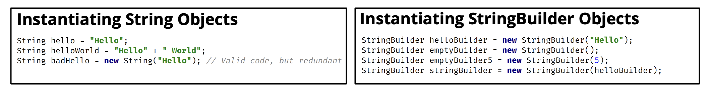
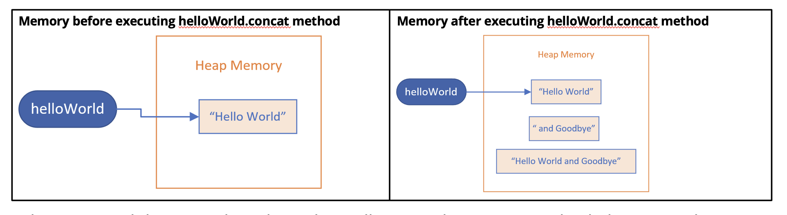
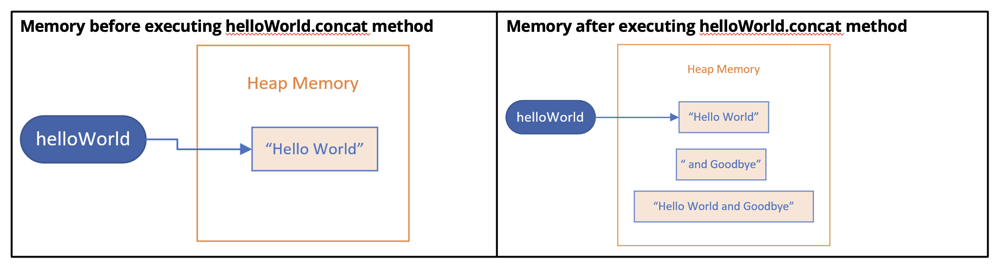

## String vs StringBuilder
Java provides a mutable class that lets us change its text value.

This is the StringBuilder Class.

## Creating Instances

There are four ways to create a new StringBuilder object using new keyword:
- Pass a String.
- Pass no arguments at all.
- Pass an integer value.
- Pass some other type of character sequence (like StringBuilder).

## String

When we passed the String literal, "and Goodbye", to the concat method, this created an Object in memory for the literal, "and Goodbye".

It also created the result of the concat method, the object, the String, that has the value, "Hello World and GoodBye".

## StringBuilder

On this slide Strings and StringBuilder is different colors, with the StringBuilder object in green

After the call to the append method, we still only have one StringBuilder object.

The variable helloWorldBuilder is still referencing the same object, but the value of that object changed.

This is important because it means the character sequence in the StringBuilder changed.

## String methods vs. StringBuilder methods
String methods create a new object in memory and return a reference to this new object.

StringBuilder Methods return a StringBuilder reference, but it's really a self-reference.

## Some methods unique to the StringBuilder clas
A StringBuilder class has many similar methods to Strings.

But it also has methods to remove and insert characters or Strings. In addition, we can truncate the string builder's size.

| method | description |
| - | - |
| delete\ndeleteCharAt | We can delete a substring using indices to specify a range, or delete a single character at an index. |
| insert | We can insert text at a specified position. |
| reverse | We can reverse the order of the characters in the sequence. |
| setLength | setLength can be used to truncate the sequence, or include null sequences to 'fill out' the sequnce to that length. |