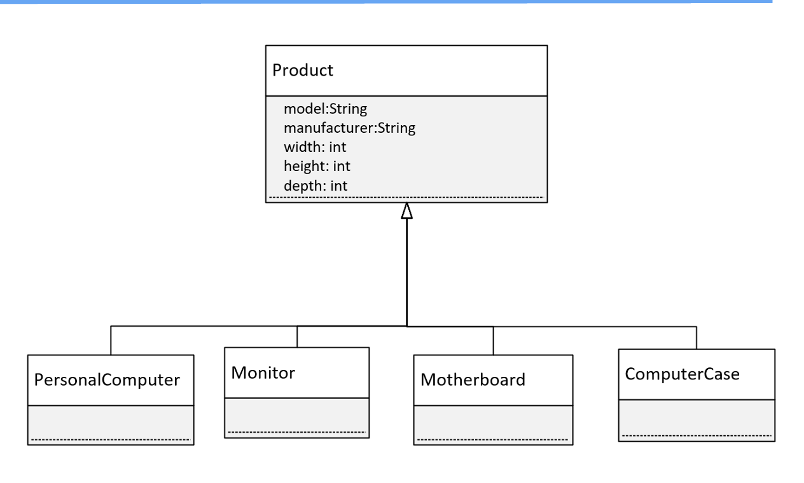
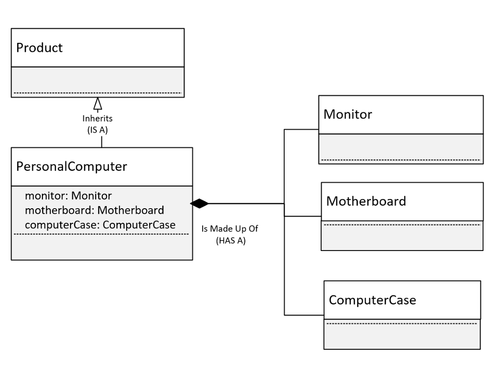
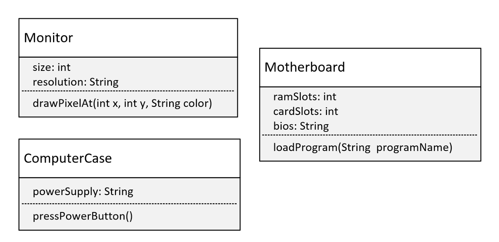
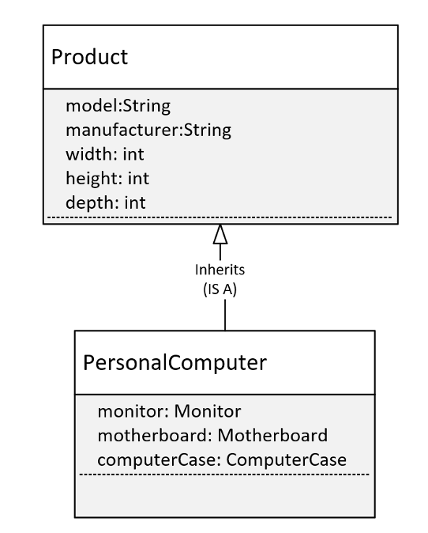

## Composition
It's time now to talk about composition.

Composition is another component of object-oriented programming.

## Inheritance
In this instance, we have a base class called Product.

All of our computer parts are going to inherit from Product.

All our parts will then have the same base set of attributes: manufacturer, model, and dimensions. The width height, and depth, in other words.

All of these items are products, a particular type of Product.s

## Inheritance vs. Composition
Inheritance defines an <b>IS A</b> relationship

Composition defines a <b>HAS A</b> relationship

To keep this diagram simple, PersonalComputer inherits from Product.

But a Personal Computer, in addition to bring a product, is actually made up of other parts.

Composition is actually modeling parts, and those parts make up a greater whole.

In this case, we're going to model the personal computer.

And we're modeling the <b>has a</b> relationship with the motherboard, the case, and the monitor.

## The parts

This diagram show the 3 classes that will make up the personal computer.

## PersonalComputer

This will be our personal computer, and it inherits from Product.

But it also has 3 fields, which are classes: these are Monitor, Motherboard, and ComputerCase.