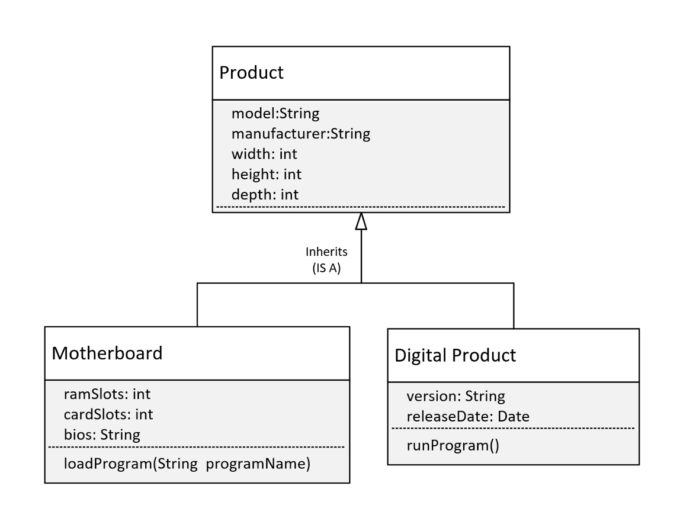
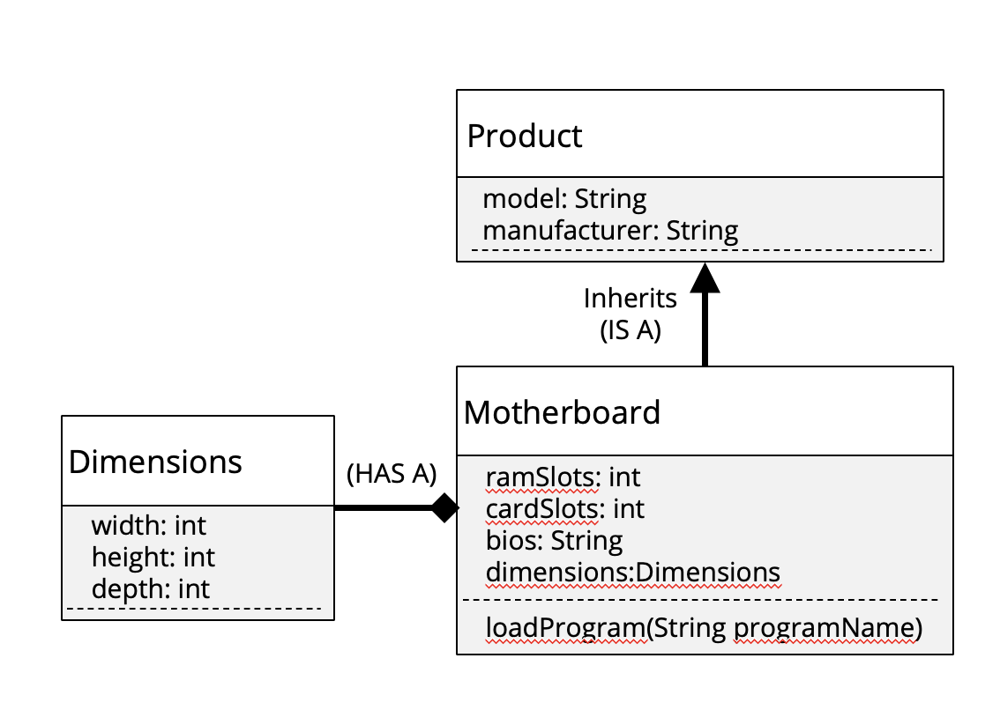

## Composition
About <b>composition</b> and compared it to inheritance.

Inheritance is a way to reuse functionailty and attributes.

Composition is a way to make the combination of classes act like a single conherent object.

## Composition is creating a whole from different parts.
I built this PC, by passing objects to the constructor, like assembling the computer.

I can actually hide the functionality further.

In this case, we're not going to allow the <b>calling program</b> to <b>access those objects, the parts directly</b>

We don't want anybody to access the Monitor, Motherboard, or ComputerCase directly.

## Use Compsition or Inheritance or Both?
As a general rule, when you're designing your programs in Java, we probably want to look at composition first.

<b>Most of the experts</b> will tell we that aa a rule, look at using composition before implementing inhertiance.

We saw in this example, We usually used both.

All of our parts were able to inherit a set of attribute, like the manufacturer and model.

the calling code didn't have to know anything about these parts to get PersonalComputer to do something.

## Why is Composition preferred over Inhertance in many designs?
The reason composition is preferred over inheritance:
- Composition is more flexible. We can add parts in or remove them, and these changes are less likely to have a downstream effect.
- Composition provides functional reuse outside of the class hierarchy, meaing classes can share attributes and behavior, by having similar components, instead of inheriting functionality from a parent or base class.
- Java's inheritance breaks encapsulation because subclasses may need direct access to a parent's state or behavior.

## Why is Inheritance less flexible?
Inheritance is less flexible.

Adding a class to or removing a class from a class hierarchy may impact subclasses from the point.

In addition, a new subclass may not need all the functionality or attributes of its parent class.

## Adding a Digital Product

Let's say we want to include digital products, such as software products in our pc inventory.

Should Digital Product inherit from Product?

Here, we show the model with Digital Product, inheriting from our current definition of Product.

If we do this, this would mean Digital Product has Product's attributes, but this isn't true now.

A digital product wouldn't really have width, height, and depth, so this model isn't good representation of what we want to build.

It would be better if we didn't have those three attributes on Product, but instead used composition to include them on certain products, but not all products.

## Revised Class Diagram

Consider this revised class diagram

We haven't completely removed the class hierarchy, but we've made the base class, Product, more generic.

We've removed the width, height, and depth attributes from Product and made a new class, Dimentions, with those attributes.

Is this a better model?
Well, it's more flexible.

This design allows for future enhancements to be made, like the addition of the subclass Digital Product, Without causing problems for existing code that may already be extending Product.

By placing width, height, and depth into a dimension class, we can use composition to apply those attributes to any product.