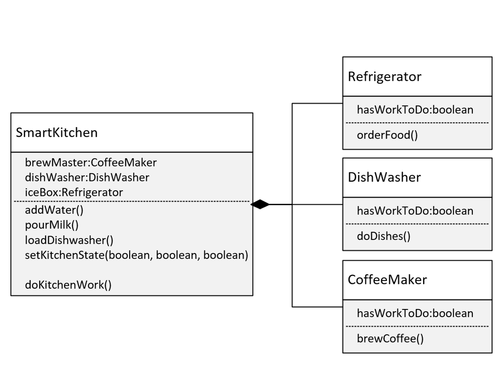

## The Composition Challenge

In this challenge, we need to create an application for controlling a smart kitchen.

Our smart kitchen will have several appliances.

Our appliances will be Internet Of Things (IoT) devices, which can be programmed.

It's our job to write the code to enable your Smart Kitchen application to execute certain jobs.

Methods on your `SmartKitchen` class, will determine what work needs to be done:

- `addWater()` will set the Coffee Maker's `hasWorkToDo` field to true.
- `pourMilk()` will set the Refrigerator's `hasWorkToDo` to true.
`loadDishwasher()` will set the `hasWorkToDo` flag to true for that appliance.

Alternately, you could have a single method called `setKitchenState` that takes three boolean values, which would set each appliance accordingly.

To execute the work needed to be done by the appliances, you'll implement this in two ways:

First, our application will access each appliance by using a getter and execute a method.

- The appliance methods are `orderFood()` on `Refrigerator`, `doDishes()` on `DishWasher`, and `brewCoffee()` on `CoffeeMaker`.  
- These methods should check the `hasWorkToDo` flag, and if true, print a message out indicating what work is being done.

Second, your application won't access the appliances directly.

It should call doKitchenWork(), which delegates the work to any of its appliances.

