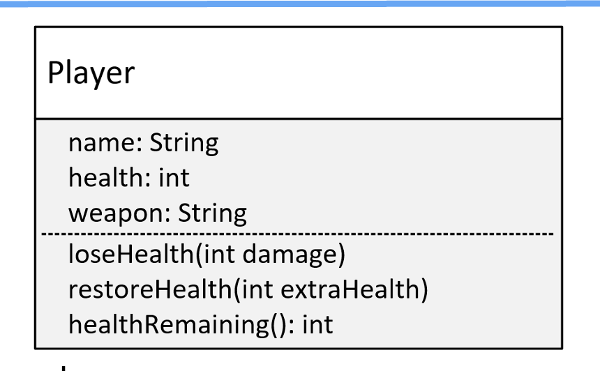

## What does Encapsulation Mean?
In java, encapsulation means hiding things by making them private or inaccessible.

## Why hide things?
Why would we want to hide things in Java?
- To make the interface simpler, we may want to hide unnecessary details

## What do we mean by interface here?
Although Java has a type called interface, that's not what I'm talking about here.

When we talk about a class's public or published interface, we're really talking about the class members that are exposed to or can be accessed by the calling code.

Everyhting else in the class is interal or private to it.

An application programming interface or API is the public contract that tells others how to use the class.

## The Player Class

This is the model for a Player class.

The Player has three fields: name, health, and weapon.

This class has three methods: `loseHealth()`, `restoreHealth()`, and `healthRemaining()`, which I'll explain shortly.

We're going to create this class without using encapsulation.

## Problem one
Allowing direct access to data on an object can potentially bypass checks and additional processing our class has in place to managee the data.

## Problem Two
Allowing direct access to fields means calling code would need to change when we edit any of the fields.

## Problem Three
Omitting a constructor that would accept initialization data means the calling ocde is responsible for setting up this data on the new object.

