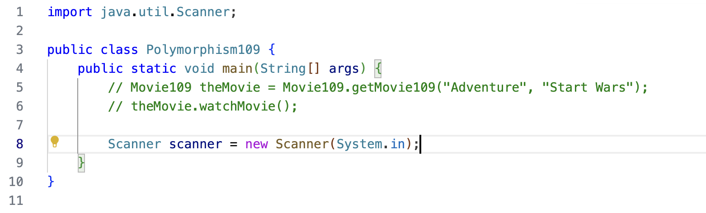

## Imports
In the Exception handling video in section 6, we showed how to manually add import lines.

Because we still have Auto Imports enabled, we just saw how IDE added the import for us automatically.


## Polymorphism in action
That was polymophism in action.

It's the ability to execute different behavior, for different types, which are determined at runtime.

And yet, we did it with just two statements in the main method, as shown here.

```java
Movie movie = Movie.getMovie(type, title);
movie.watchMovie();
```

Polymorphism enables us to write generic code based on the base class or a parent class.

And this code in the main method is extendable, meaning, it doesn't have to change as new subclasses become available.

This code can handle any instances that are a movie or a subclass of movie that are returned from the factory method.

