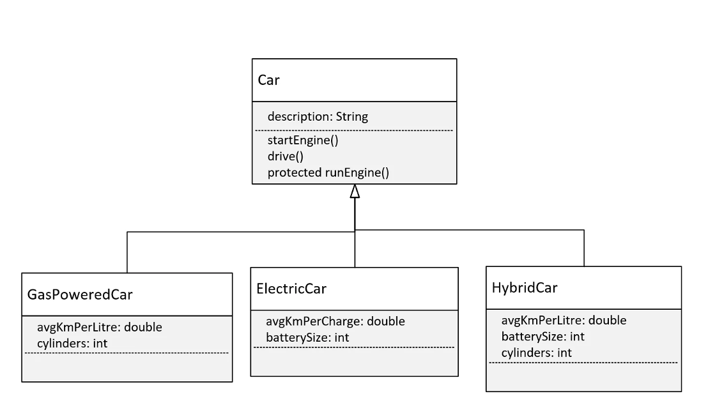

## Polymorphism Challenge
Welcome to the Polymorphism Challenge video.

I've said that polymorphism means many forms.

What we want to do in this challenge is have our runtime code execute different behavior for different objects.

Let's talk about the requirements for this challenge.

This diagram shows a base class, Car, with one field, description, and three methods, `startEngine()`, `drive()`, and `runEngine()`. 

The first two methods should be declared as public.

The method, runEngine, however, is protected, and it will only get called from the drive method in Car.

And here, we've have three types of subclasses or three types of cars that you might find on the road.

We have the `GasPoweredCar`, the `ElectricCar`, and the `HybridCar`.

We can imagine that these three subclasses might have different ways to start their engine or drive, depending on their engine type.

Each of these classes might also have different fields that might be used in those methods.

It's our job to create this class structure in Java and override methods appropriately.

And we'll write code in a Main class and main method that creates an instance of each of these classes and that executes different behavior for each.

At least one method should print the type of the runtime object.
