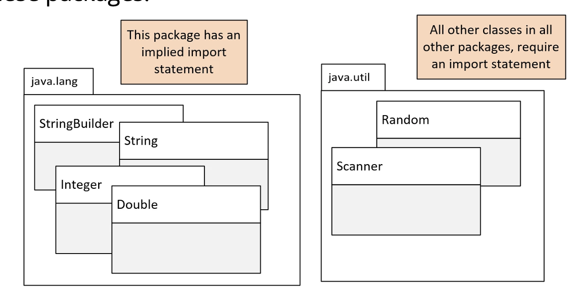
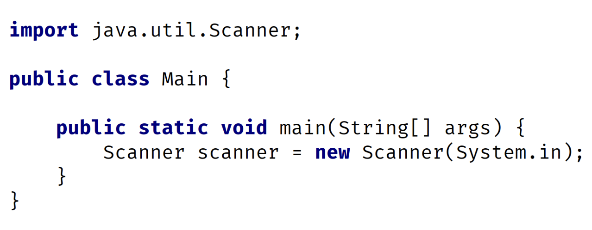
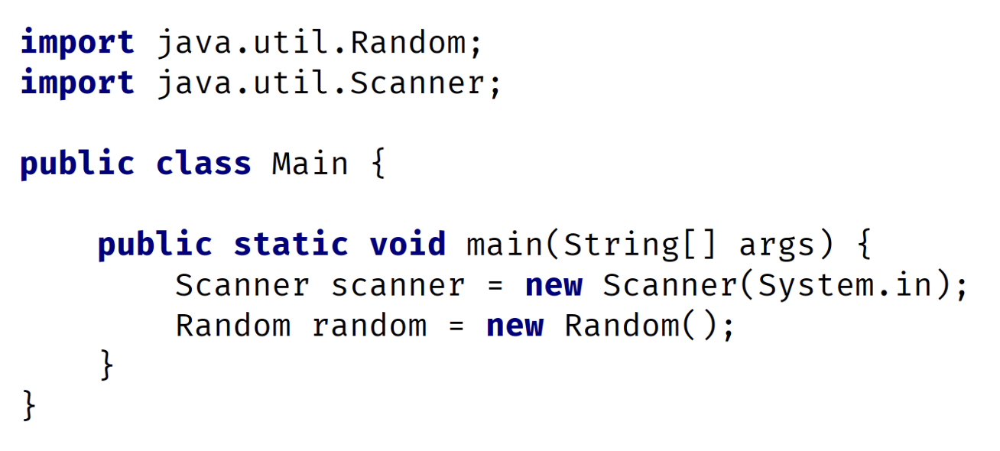
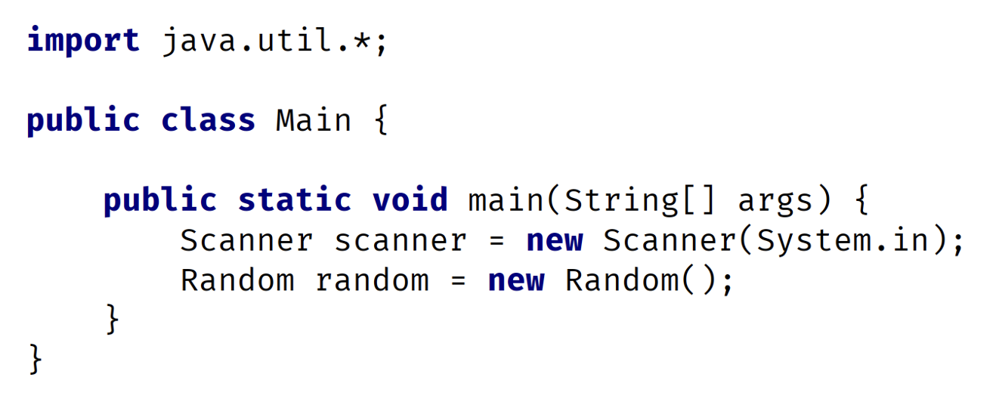
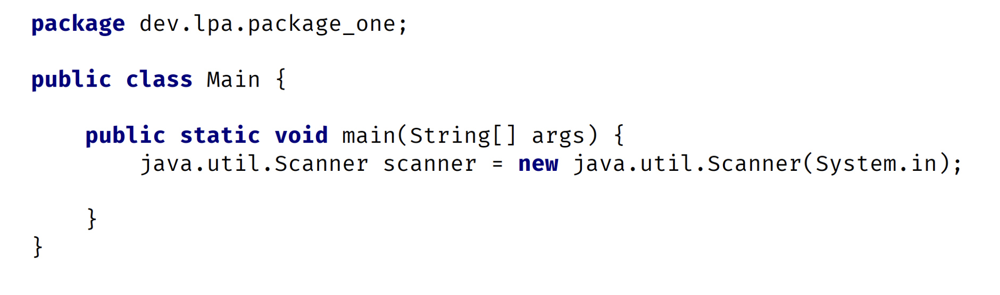
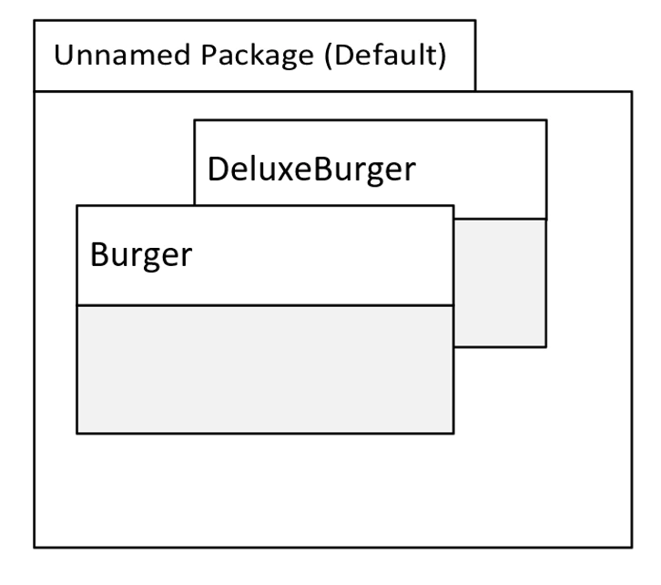

## Orgainizing Java Classes
Up until this point in the class, we haven't created a lot of classes, so we havent' had to think much about organizing those classes.

As the course progresses, we're going to be using more and more of Java's libraries, and our applications are going to get more complex.

This feels like a good time to talk about the `package` and `import` statements in more detail.

I've talked briefly about `import statements` when we used the `Scanner` class, and we mentioned packages when we talked about `access modifiers`.

In this video, we want to focus on what a package is, why we'll be using them moving forward, and how to access classes in different packages.

## package
As per the Oracle Java Docs.

A package is a namespace that organizes a set of related types.

In general, a package corresponds to a folder or directory on the operating system, but this isn't a requirement.

When using an IDE like Intellij, we don't have to worry about how packages and classes are stored on the file system.

The package structure is hierarchical, meaning we group types in a tree-like fashion.

We can use any legal Java identifier for our package names, but common practice has package names in all lowercase.

The period separates the hierarchial levels of the package.

## Java packages
By now, we're familiar with two of Java's packages, `java.lang` and `java.util`.

On this slide, thse two packages with some of the classes we've used to date, as shown within these packages.

## Using classes from packages other than java.lang - the import statement
We may remember, when we used the `Scanner` and `Random` classes, we were required to use an import statement.

An exmaple of using the Scanner class in this code.

The import statement has to be declared before any class or type declarations but after any package statement.

In thise code, we don't have a package statement, so the import statement must be the first statement in the code.

## Multiple import statement
There is no limit to the number of import statements we can have.

These code shows two import statements, one for the Random class and one for the Scanner class.

## Using import statements with wildcards
Alternatively, we could use a wildcard with the asterisk character in the import statement.

In the following code, we're telling Java to import all classes from the `java.util` package with the use of the asterisk after the `java.util` package reference.

## What is the purpose of packages?
Packages let use reuse common class names across different libraries or applications and provide a way to identify the correct class either with an import statement or qualifying name.

For example, we might have a package for utility classes that can provide common functionality for all of our classes to access.

Packages let use organize our classes by functionality or relationship.

Packages also let us encapsulate our classes from classes in other packages.

We might have a package of tightly coupled classes that should only be accessed by each other but not by the outside orld, as an example.

## What would a package name look like?
We've seen that Java starts their package names with java in some of the examples we've looked at.

However, it is common practice to use the reverse domain name to start our own package naming conventions.

if our company is abccompany.com, for example, our package prefiexs would be com.abccompany.

For the rest of the course, we'll be using dev.lpa, which is the reverse domain of one of our Learn Programming Acedemy domains.

The package name hierarchy is separated by periods.

## using the package statement
The package statement needs to be the first statement in the code, with the exception of comments and whitespace.

The package statement comes before any import statements.

There can be only one package statement because a class or type can only be in a single package.

## The Fully Qualified Class Name (FQCN)
In this code, we created a class called Main.

A class's fully qualified class name <b>(FQCN)</b> consist of the packages name and the class name.

So, this class's fully qualified name is dev.lpa.package_one.Main.

It's unlikely, this class, with its fully qualified name, will have a naming conflict with a Main class in another package.

As another example, the fully qualified class name this `Scanner` class in this code is `java.util.Scanner`.

## The Fully Qualified Class Name vs the import statement
We can use the fully qualified class name instead of the import statement, as here on thise slide

This code does not use the import statement, but instead, where the Scanner class is referened, the fully qualified class name is used.

We can probably imagine thise could get very tedious, very quickly, if we wrote our code this way.

Later in the course, we'll talk about using a combination of the import statement and the fully qualified class name to resolve conflicts.

## Using the package statement
In this slide, two classes from our previous challenge in the unnamed or default package.

This is where classes are implicitly placed if we don't specify a package statement.

For our applications, we should always specify a package statement and avoid using the default or unnamed package.

Although that's all we've been using up until now, it has some disadvantages when we work in a true development environment.

The main disadvantage is that we can't import types from the default package into other classes outside of the default package.

In other words, we can't qualify the name if it's in the default package, and we can't import classes from the default package.
