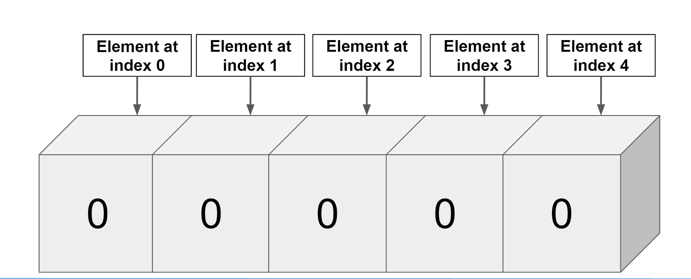
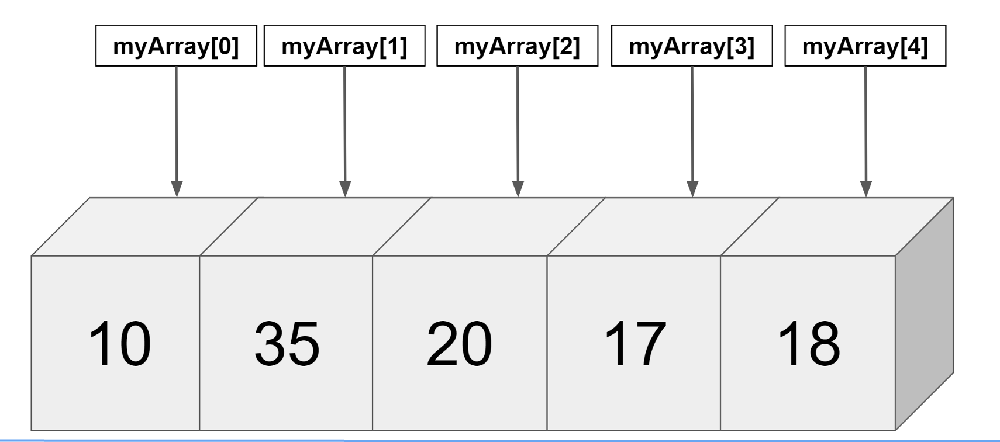
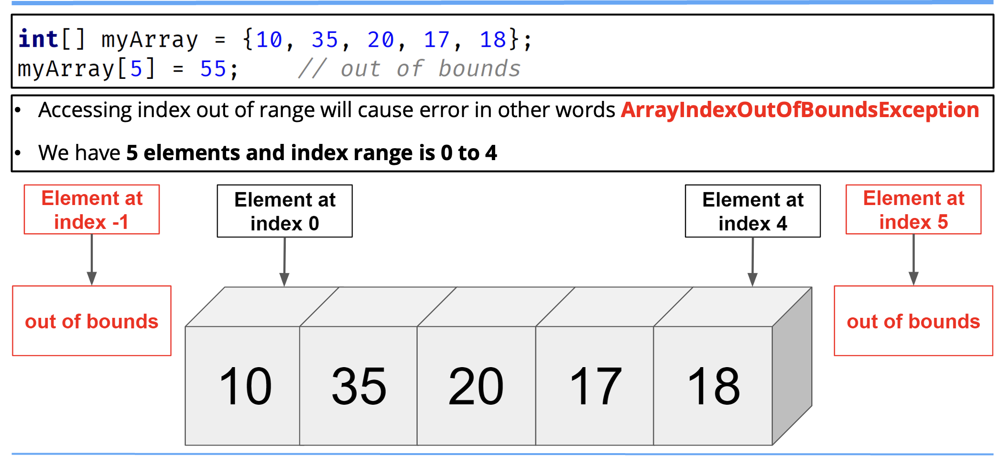
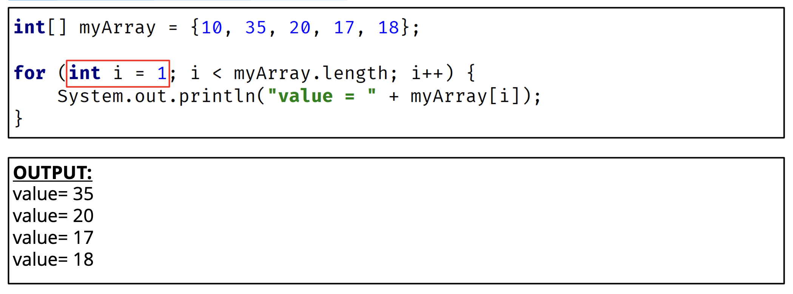
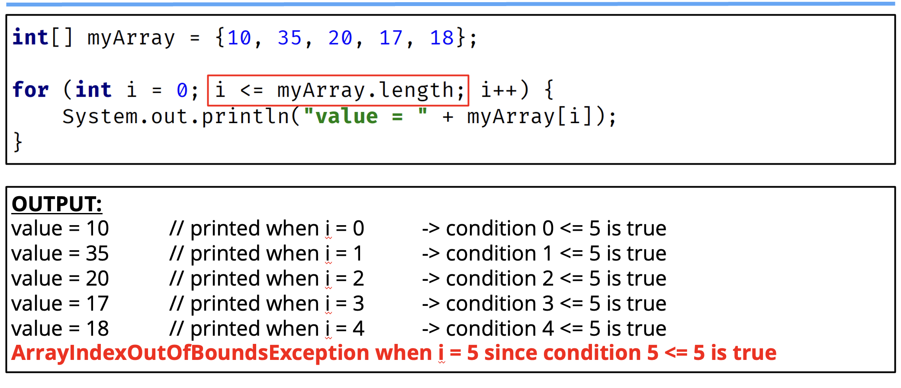
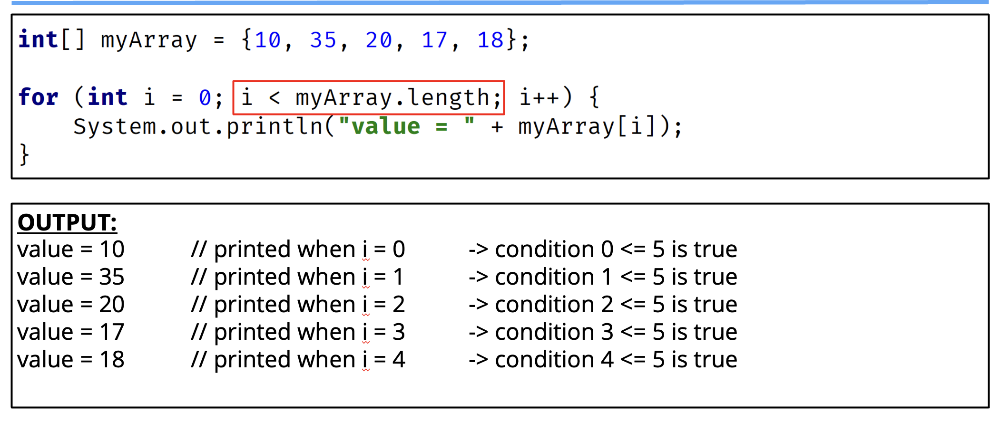

## Arrays Recaps
- An array is a data structure that allows us to store multiple values of the sample type in a single variable. 
- The default values of numeric array elements are set to zero.
- Array are zero-indexed, so an array with n elements is indexed from 0 to n - 1. For example, 10 elements would have the index range from 0 through 9.
- If we try to access an index that is out of range, Java will give us an ArrayIndexOutOfBoundsException, which indicates that the index is out of range, in other words, out of bounds.
- TO access array elements, we use square braces. This is also known as the array access operator.

## Array Recap - Creating a New Array
```java
int[] array = new int[5];
```

This array contains the elements from array[0] through array[4].

It has 5 elements and an index range from 0 to 4.

The new keyword is used to create the array and initialize the array elements to their default values.

In this example, all the array elements will default to zero because it is an int array.

For boolean arrays, elements would be initialized to false.

If we use String or other objects, they would be set to a `null` reference.

WE can also initialize an array inline using an array initializer block, as shown here.

```java
int[] myNumbers = {5, 4, 3, 2, 1};
```

We define the values for the array in curly braces, in the order we want them assigned, each value separated by a comma.

```java
int[] array = new int[5];
```



```java
int[] array = {10, 35, 20, 17, 18};
```



## First Common Error


## Second Common Error


## Third common Error




## Use Enhanced For Loop to avoid some of these errors.
User the enhanced for loop if we're looping through elements from first to last, and we want to process them one at a time, and we're not setting or assigning values to elements.

| Enhanced For Loop (Preferred for this kind of processing) |
| - |
```java
int[] myArray = {10, 35, 20, 17, 18};

for (int myInt : myArray){
    System.out.println("value = " + myInt);
}
```
| Traditional For Loop |
| - |
```java
int[] myArray = {10, 35, 20, 17, 18};

for (int 0; i < myArray.length; i++){
    System.out.println("value = " + myArray[i]);
}
```