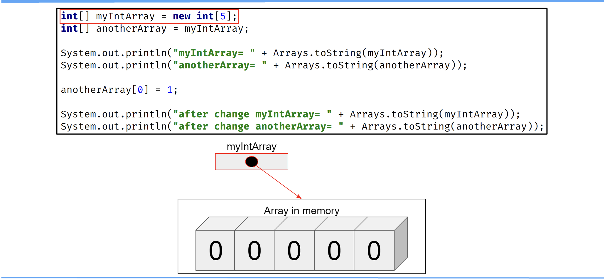
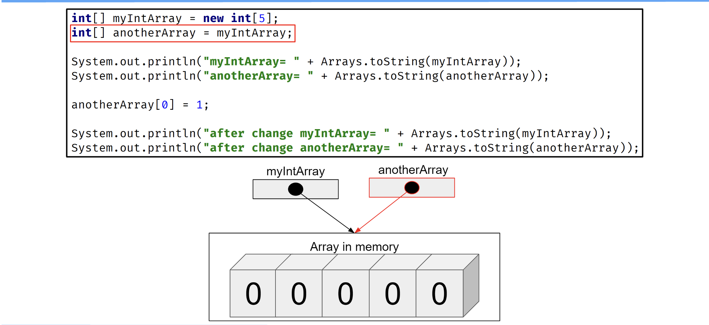
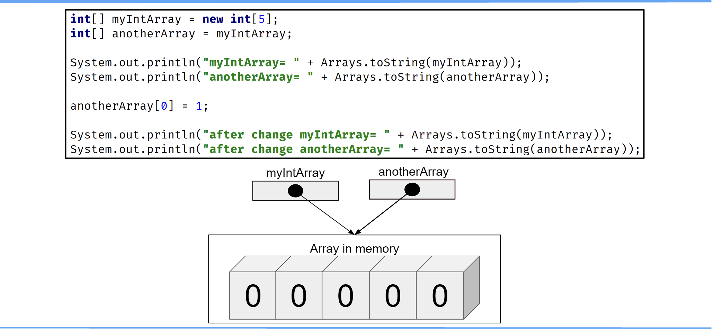
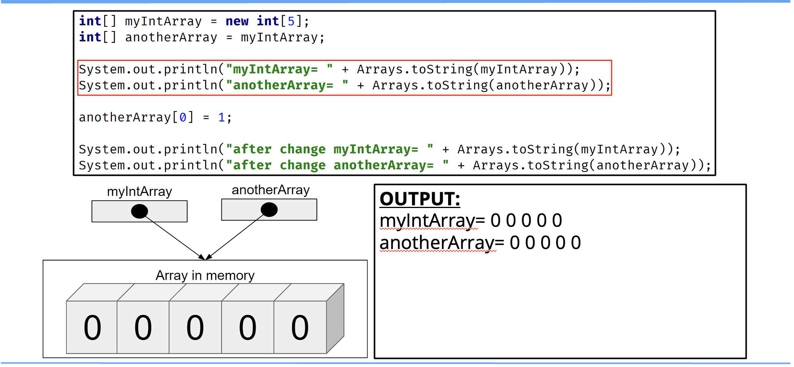
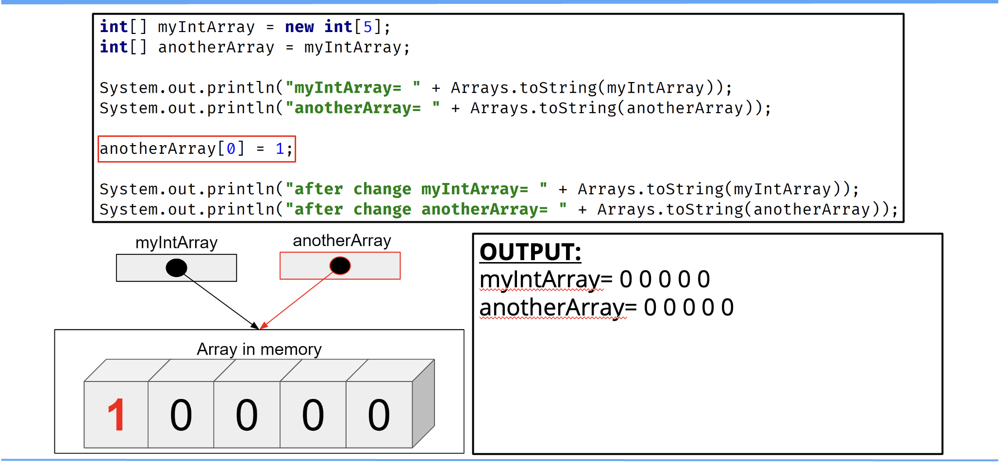
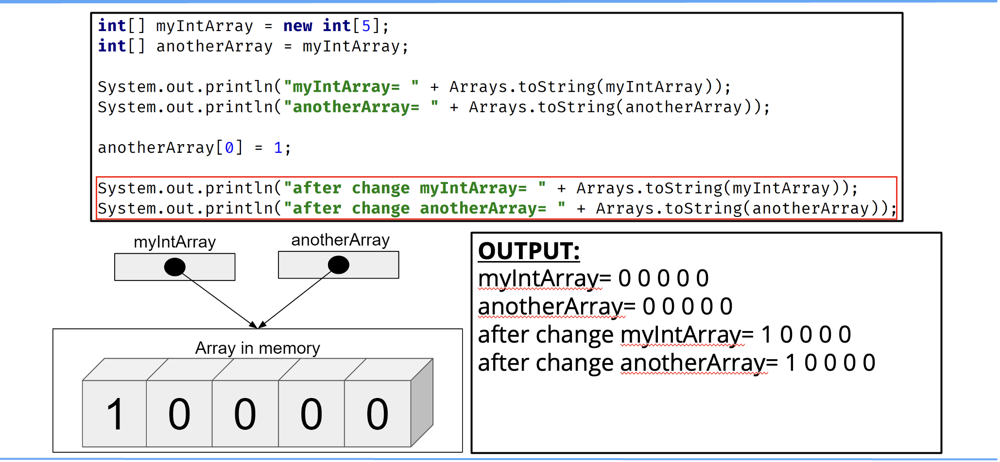

## Reference Types vs. Value Types
We talked about the differences between a Reference vs. an Object. an Instance, vs. a Class.

When we assign an object to a variable, the variable becomes a reference to that object.

This is true of arrays, but the array has yet another level of indirection if it's an array of objects.

This means every array element is also a reference.

