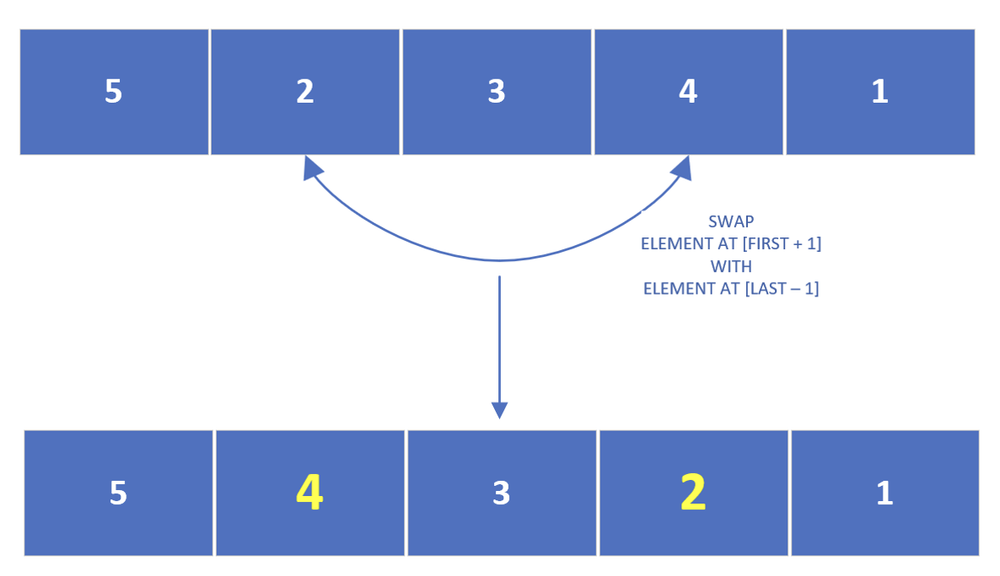

## The Reverse Array Challenge
The challenge is to write a method called reverse that takes an int array as a parameter. 

In the main method, call the reverse method and print the array before and after the reverse method is called.

To reverse the array, you have to swap the elements so that the first element is swapped with the last element and so on.

For example, if the array contains the numbers 1,2,3,4,5, then the reversed array should be, 5,4,3,2,1.

This shows the array before we start reversing the values and the end result we want to achieve:

How would we go about doing this?

We could start swapping the elements at positions 0 and 4, to get this interim result after the first iteration.

Then swap the elements at the next positions, which we could describe as:

Swapping the element at first plus one position with the element at the last minus one position.

At this point, for a 5 element array, you'd actually be done with the reverse process.

Notice the middle element never had to be swapped at all.

This process would take only two iterations to complete for five numbers.

It would take three iterations for seven numbers, etc.

We start with the outermost elements, swapping them, and work our way towards the center item.

If the number of elements is odd, we can leave the middle element unswapped. 

We can think of the middle element as the pivot point.

