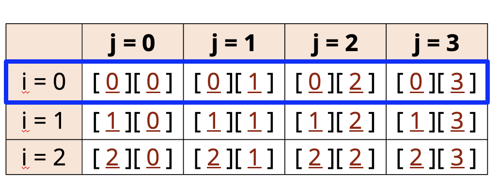

## Java's nested Arrays
An array element can actually itself be an array. It's know as a nested array, or an array assigned to an outer array's element.

This is how Java supports two and three dimentional arrays of varying dimentions.

## Two-Dimentional Array
A two-dimensional array can be thought of as a table or matrix of values with rows and columns.

We can use an array initializer for this.

In this example, all the nested arrays have the same length.

| Array Initializer formatted over multiple lines |
| - |
```java
int[][] array = {
    {1, 2, 3},
    {11, 12, 13},
    {21, 22, 23},
    {31, 32, 33},
};
```
| Array Initializer declared on one lines |
| - |
```java
int[][] array = {{1, 2, 3},{11, 12, 13},{21, 22, 23},{31, 32, 33}};
```

A 2-dimensionl array doesn't have to be a uniform matrix though.

This means the nested arrays can be different sizes, as this next initialization statement.

```java
int[][] array = {
    {1, 2, 3},
    {11, 12, 13},
    {21, 22, 23},
    {31, 32, 33},
};
```
Here, we have an array with 3 elements.

Each element is an array of integers (a nested array).

Each nested array is a different lenght.

If we find that confusing, no worry, It would all make sense shortly.

We can initalize a two-dimensinal array and define the size of nested arrays, as shown here.

```java
int[][] array = new int[3][3];
```

This statement says we have an array of 3 nested arrays, and each nested array will have three ints.

The result of this init is shown in the table on below slide.

Java knows we ant a 3x3 matrix of ints and defaults the values of the nested arrays to zeros, as it would for any array.
| | 0 | 1 | 2 |
| - | - | - | - |
| 0 | 0 | 0 | 0 |
| 1 | 0 | 0 | 0 |
| 2 | 0 | 0 | 0 |

We can init a two-dimensional array without specifying the size of the nested arrays.

Here, we're specifying only the outer array size by specifying the length, only in the first set of square brackets.

We've left the second set of square brackets empty.

```java
int[][] array = new int[3][];
```

The result of this init is an array of 3 null elements.

We are limited to assigning integer arrays to these elements, but they can be any length.

| int[][] myDoubleArray; |
| - |
| int[] myDoubleArray[]; |

We can also split up the brackets as shown in the second example, and we'll likely come accross this in Java code out in the wild.

## Accessing elements in multiple-dimensional arrays
When we access a one dimensional array element, we do it with square brackets and an index value.

So this code sets the first element in the array to 50:

```java
array[0] = 50;
```

To access elements in a two-dimensional array, we use two indices, so this code sets the first element int the first array to 50.

```java
secondArray[0][0] = 50;
```

This next code sets the second element, in the second array to 10.

```java
secondArray[1][1] = 10;
```

The code on this slide is similar to the code we have used IDE, using nested traditional for loops.

In this case, we're not using any local variables, but accessing array elements and variables directly.

```java
for (int i = 0; i < array2.length; i++) {
    for (int j = 0; j < innerArray.length; j++){ // while i = 0, j will loop from 0 to 3
        System.out.println(array2[i][j] + ៉ );
    }
}
```


This table shows the indices, which are used to access the elements in the two-dimensional array in our code sample.

When we loop through the outer loop, we're accessing each row of elements. 

I've highlighted the first row, which would be the elements accessed, when i = 0 for the outer for loop.

When we loop through the inner loop, we're accessing each cell in the array.

A cell in this matrix can be any type. 

In our code, each is an integer value, and we know they've all been initialized to zero.


