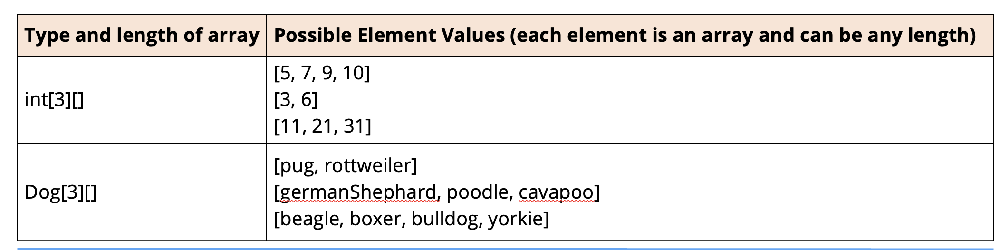

## Two dimensional Array
When we declare multi-dimensional arrays, the declared type can itself be an array, and this is how Java supports 2D arrays:
```java
int[][] = my Array = new int[3][];  // Declare and instantiates an rray of 3 integer arrays,
                                    // Whose sizes are not specified.

Dog[][] myDogs = new Dog[3][];      // Declare and instantiates an array of 3 arrays.
                                    // Which will have Dog elements, again, the sizes of the inner arrays aren't    specified
```



## Multi Dimensional Array
We can take that even further, the outer array can have references to any kind of array itself.

In this example, we have an outer array with three elements.

```java
Object[] multiArray = new Object[3];
multiArray[0] = new Dog[3];
multiArray[1] = new Dog[3][];
multiArray[2] = new Dog[3][][];
```

The first element is itself a single-dimensional array.

The second element is a two-dimensional array.

And lastly, the third element is a three-dimesional array.