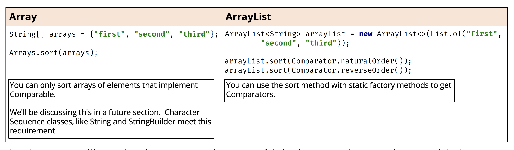

## Arrays vs ArrayLists
This slide demonstrates that Arrays and ArrayList have more in common than they don't

| Feature | Array | ArrayList |
| - | - | - |
| primitive types supported | Yes | No |
| Indexed | Yes | Yes |
| ordered by index | Yes | Yes |
| duplicates allowed | Yes | Yes |
| nulls allowed | Yes, for non-primitve type | Yes |
| Resizable | <b>No</b> | Yes |
| mutable | Yes | Yes |
| inherits from java.util.Object | Yes | Yes |
| implements List interface | No | <b>Yes</b> |

## Instantiating without Values
| Instantiating Arrays | Instantiating ArrayLists |
| - | - |
| String[] array = new String[10]; | ArrayList<String> arrayList = new ArrayList<>(); |
| An array of 10 elements is created, all with null references. The compiler will only permit Strings to be assigned to the elements. | An empty ArrayList is Created.<br>The compiler will check that only Strings are added to the ArrayList. |

On this slide, the difference when creating a new instance of an array compared to a new instance of an ArrayList.

An array requires square brackets in the declaration.

On the right-hand side of the equals sign, square brackets are also required with a size specified inside.

An ArrayList should be declared with the type of element for the ArrayList in angle brackets.

We can use the diamond operator when creating a new instance in a declaration statement.

We should use a specific type rather than just the Object class because Java can then perform compile-time type checking.

## Instantiating with Values

We can use an array initializer to populate array elements during array creation.

This feature lets us pass all the values in the array as a comma delimited list in curly braces.

When we use an array init in a declaration statement, we can use what's called the anonymous version. as we show here.

We can use an ArrayList constructor that takes a collection or a list of values during ArrayList creation.

The `List.of` method can be used to create such a list, with a variable argument list of elments.

## Element information


The number of elements is fixed when an array is created.

We can get the size of the array from the attribute length on the array instance.

Array elements are accessed with use of square brackets and an index that ranges from 0 to one less than the number of elements.

The number of elements in an ArrayList may vary and can be retrieved with a method on the instance, named `size()`.

ArrayList elements are accessed with get and set methods, also using an index ranging from 0 to one less than the number of elements.

## Getting a String representation for Single Dimension Arrays and ArrayLists

ArrayLists come with built-in support for printing out elements, including nested lists.

Arrays don't though, so we need to call Arrays.toString, passing the array as an argument.

This slide shows example of single dimension arrays and ArrayLists.


Here, the example of multi-dimesional arrays and ArrayLists, and how to print the elements in each.

A multi-dimensional ArrayList simply has a type, which in itself is an ArrayList.

For a multi-dimesional array, we need to call the `Arrays.deepToString` method, passing the array as an argument.

For nested ArrayLists, we can still just pass the ArrayList instance directly, to System.out.println, as show here.

## Finding an element in an Array or ArrayList

For arrays, we can use the `binarySearch` method to find a matching element, although this method requires that the array be sorted first.

In addition, if the array contains duplicate elements, the index returned from this search is not guaranteed to be the position of the first element.

We can use `contains` or `containsAll`, which simply returns a boolean if a match or matches were found.

In addition, like th `String` and `StringBuilder`, we have the methods, `indexOf` and `lastIndexOf`, which will return the index of the first or last match.

When a -1 is returned from these methods, no matching entry was found.

## Sorting


Sorting seems like a simple concept when we think about sorting numbers and `Strings`.

We know there is a natural order for numbers and even for `Strings`.

We can use the Arrays.sort method, for arrays with numeric primitive types and wrapper classes, as well as `Strings` and `StringBuilders`.

For the ArrayList, we can use the sort method again for numeric wrapper classes, `Strings` and `StringBuilders`.

We pass a `Comparator` type argument to ArrayList's sort method that specifies how the sort should be performed.

We call static methods on the `Comparator` type to get a `Comparator` for either a natural order, or revers order sort.

## Array as an ArrayList
```java
String[] originalArray = new String[] {"First"};

var originalList = Arrays.asList(originalArray);
```

There are times when we'll want to switch between  an Array and an ArrayList, and there is support for this on the Arrays class and the ArrayList class.

The `Arrays.asList` method returns an ArrayList backed by an array.

There, the creation of a three element array.

Then the code uses the Arrays.asList method, passing it the array, and assigning the result. a List of Strings, to a variable, originalList.

We can think of this conceptually, as putting an ArrayList wrapper of sorts around an existing array.

Any change made to the List is a change to the array that backs it.

This also means that an ArrayList created by this method is not resizable.

## Creating Special Kinds of Lists


This slide demonsrates two ways to create a list, From elements or from an array of elements.

Both are static factory methods on types.

The first is the `asList` method on the Arrays class, and it returns a special instance of a Lit that is not resizable, but is mutable.

The second is the of method on the List interface, and it returns a special instance of a List that is immutable.

Both support variable argument, so we can pass a set of arguments of one type, or we can pass an array.s

We are showing examples of both here, first using variable arguments, and second, passing an array.

```java
ArrayList<String> stringLists = new ArrayList<>(List.of("Jan", "Feb", "Mar"));
String[] stringArray = stringLists.toArray(new String[0]);
```

This slide shows the most common method to create an array from an ArrayList using the method toArray.

This method takes one argument which should be an instance of a typed array.

This method returns an array of that same type.

If the length of the array we pass has more elements than the list, extra elements will be filled with the default values for that type.

If the length of the array we pass has less elements than the list, the method will still return an array, with the same number of elements in it, as the List.

In the example shown here, we pass a String array with zero as the size, but the array returned has three elements, which is the number of elements in the list.