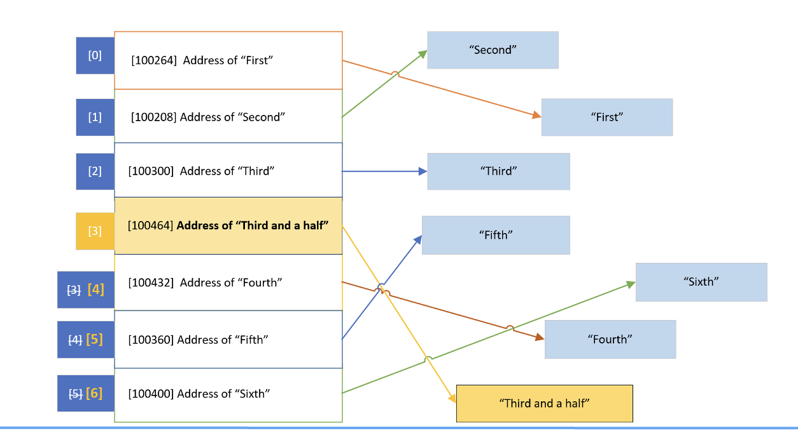
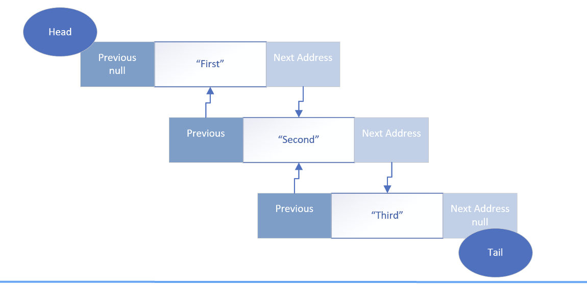
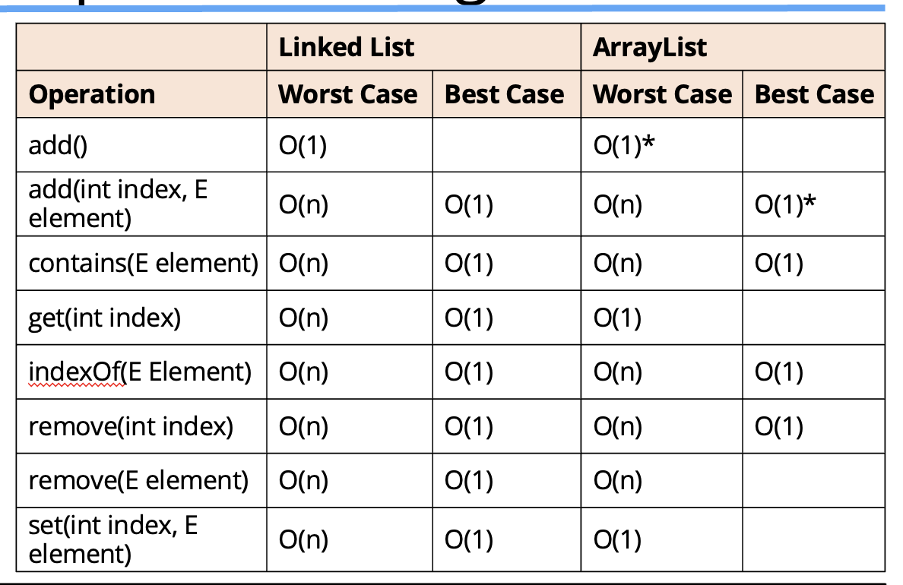

## Array of primitive values

| index | Value | Address |
| - | - | - |
| 0 | 34 | 100 |
| 1 | 18 | 104 |
| 2 | 91 | 108 |
| 3 | 57 | 112 |
| 4 | 453 | 116 |
| 5 | 68 | 120 |
| 6 | 6 | 124 |

When an array of primitve types is allocated, space is allocated for all of it's elements contiguously.

We can see from this slide that we have an array of <b>seven integers</b>

The index position is in the left column, and that's the number we use to access a specific array value.

So the first element, when we use index position 0, this will retrieve the value 34.

When we use index position 1, this gets the value of 18, and so on. 

If 100 is the address of an integer and we know an integer is 4 bytes, then address of the next integer if it's contiguous would be 104, as we show here for the second element.

Java can use simple math using the index and the address of the initial element in the array to get the address and retrieve the value of the element.

## Arrays and ArrayLists of reference types


For reference types (meaning anything that's not a primitive type) like a String or any other object, the array elements aren't the values, but the addresses of the referenced object or String. 

There's a level of indirection as we show on this slide.

We've learned that ArrayLists are really implemented with arrays under the covers.

This means our objects aren't stored contiguously in memory, but their addresses are, in the array behind the ArrayList.

And again, the addresses can be easily retrieved with a bit of match, if we know the index of the element.

This is a <b>cheap</b> or fast lookup and doesn't change no matter what size the ArrayList is.

But to remove an element, the referenced addresses have to be re-indexed or shifted to remove an empty space.

And when adding an element, the array that backs the ArrayList might be too small and might need to be reallocated.

Either of these operations can be an <b>expensive</b> or time-consuming process if the number of elements is large.

In this slide, the String, "Thirs and a half", represents a new element we want inserted at index position 3.

This means all the elements below this point need to be moved and re-indexed.

## ArrayList capacity
An ArrayList is created with an initial capacity depending on how many elements we create the list with, or if we specify a capacity when creating the list.

```java
ArrayList<Integer> initList = new ArrayList<>(10);
for (int = 0; i < 7; i++){
    initList.add((i + 1) * 5);
}
```
| Index | 0 | 1 | 2 | 3 | 4 | 5 | 6 | 7 | 8 | 9 |
| - | - | - | - | - | - | - | - | - | - | - |
| Value | 5 | 10 | 15 | 20 | 25 | 30 | 35 | | | |

On this slide, we show an `ArrayList` that has a capacity of 10 because we're passing 10 in the constructor of this list.

We can add 3 more elements using the ArrayList add method, and the array that is used to store the data doesn't need to change.

```java
ArrayList<Integer> initList = new ArrayList<>(10);
for (int = 0; i < 7; i++){
    initList.add((i + 1) * 5);
}
initList.add(40);
initList.add(45);
initList.add(50);
```

The elements at indices 7, 8 and 9 get populated.

| Index | 0 | 1 | 2 | 3 | 4 | 5 | 6 | 7 | 8 | 9 |
| - | - | - | - | - | - | - | - | - | - | - |
| Value | 5 | 10 | 15 | 20 | 25 | 30 | 35 | 40 | 45 | 50 |

## ArrayList capacity is reached

But if the number of elements exceeds the current capacity, Java needs to reallocate memory to fit all the elements, and this can be a costly operation, especially if your ArrayList contains a lot of items.

```java
ArrayList<Integer> initList = new ArrayList<>(10);
for (int = 0; i < 7; i++){
    initList.add((i + 1) * 5);
}
initList.add(40);
initList.add(45);
initList.add(50);

initList.add(55);   // This add exceeds the ArrayList capacity.
                    // Assuming an initial capacity of 10.
                    // as an example.
```

| Index | 0 | 1 | 2 | 3 | 4 | 5 | 6 | 7 | 8 | 9 | 10 | 11 | 12 | 13 | 14 |
| - | - | - | - | - | - | - | - | - | - | - |  - | - | - | - | - |
| Value | 5 | 10 | 15 | 20 | 25 | 30 | 35 | 40 | 45 | 50 | 55 | | | |

If our code simply calls add on this ArrayList, the next operation is going to create a new array, with more elements, but needs to copy the existing 10 elements over.

Then the new element is added. we can imagine this add operation costs more, in both time and memory, than the previous add methods did.

When java reallocates new memory for the ArrayList, it automatically sets the capacity to a greather capacity.

But the Java language doesn't really specify exactly how it determines the new capacity or promise that it will continue to increase the capacity in the same way in future versions.

From their own docs, Java states that, "The details of the growth policy are not specified beyond the fact that adding an element, has constant amortized time cost".

Ok, maybe you're interested in what constant amortized time is.

## Big O Notation
Maybe we've heard people talking about Big O Notation, or Big O, and wondered what this means.

We won't get too deep into it. but there are a couple of concepts that are fairly easy to grasp, and will help us understand how <b>cheap</b> or <b>expensive</b> an operation is in terms of time and memory usage, as the operation scales.

This means its a way to express how well the opeartion performs when applied to more and and more elements.

<b>Big O</b> approximates the cost of an operation for a certain number of elements called n.

Cost is usually determined by the time it taks, but it can include memory usage and complexity, for example.

As n ( the number of elements) gets bigger, an operation's cost can stay the same.

But cost often grows as the number of elements grow.

Cost can grow linearly, meaning the cost stays in step with the magnitude of the number of elements.

Or costs can grow exponentially or by some other non-linear fashion.

In a perfect world, an operations's time and complexity would never change. This ideal world, in Big O Notation is O(1), sometimes called constant time.

So, if we have 10 elements, the cost is 10 times what it would be for 1 element because the operation may have to execute some functions up to 10 times vs. just once, and 100 times for 100 elements, for example

O(n) is generally our worst cast scenario for List operations, but there are Big O Notations, for worse performers.

## Constant Amortized Time Cost
Another scenario is the one the Java docs declared for the growth of the ArrayList that adding an element has constant amortized time cost.

In our case, we'll designate this constant amortized time as O(1)*.

This means that in the majority of cases, the cost is close to O(1), but at certain intervals the cost is O(n).

If we add an element to an ArrayList where the capacity of the List is already allocated and space is available, the cost is the same each time, regardless of how many elements we add.

But as soon as we reach the capacity and all the elements (all n elements) need to be copied in memory, this single add would have a maximum cost of O(n).

After this operation, that forced a reallocation, any additional add operations go back to O(1), until the capacity is reached again.

As the expensive intervals decrease, the cost gets closer to O(1), so we give it the notation O(1)*.

## ArrayList Operations - Big O

This slide shows the Big O values for the most common ArrayList operations or methods.

Let's talk about one example, the contains method, which looks for a matching element, and needs to traverse through the ArrayList to find a match.

It could find a match at the very first index, this is the best case scenario, so it's O(1).

It might not find a match until the last index, this is the worst case scenario, so it's O(n).

In general, the cost will be something in between for the contains method because the element will be found somewhere between the first and nth(or last) element.s

We'll notice that the indexed methods are usually O(1), remembering that finding an element by its index is a simple calculation.

It only gets costly with indexed add or remove methods, if the ArrayList needs to be re-indexed, or resized.s

## LinkedList
This architecture is called a doubly linked list, meaning an element is linked to the next element, but it's also linked to a previous element, in this chain of elements.

The beginning of the chain is called the head of the list, and the end is called the tail.

This can also be considered a queue, in this case, a double ended queue, because we can traverse both backwards and forwards, through these elements


## LinkedList - Retrieval of an Element costs more than an ArrayList retrieval
Getting an element from the list or setting a value of element, is'nt just simple math anymore with the LinkedList type.

To find an element, we'd need to start at the head or tail, and check if the element matches or keep track of the number of elements traversed, if we are matching by an index because the index ins't stored as part of the list.

For example, even if we know we want to find the 5th element, we'd still have to traverse the chain this way to get the fifth element.

This type of retrieval is considered expensive is computer currency, which is processing time and memory usage.

On the other hand, inserting and removing an element, is much simpler for this type of collection.

## LinkedList - Inserting or Removing an Element may be less costly than using an ArrayList
In constrast to an ArrayList, inserting or removing an item in a LinkedList is just a matter of breaking two linked in the chain, and re-establishing two different links.

No new array needs to be created, and element don't need to be shifted into different positions.

A reallication of memory to accomodate all existing elmeents is never required.

For a LinkedList, inserting and removing elements is generally considered <b>cheap</b> in computer currency, compared to doing these functions in an ArrayList.

## LinkedList and ArrayList Operations - Big O

This slide shows the Big O values for the most common shared List operations or methods for both types.

For a LinkList, adding elements to the start or end of the List will almost always be more efficient than an ArrayList.

When removing element, a LinkedList will be more efficient because it doesn't require re-indexing, but the element still needs to be found using the traversal mechanism, which is why it is O(n), as the worst case.s 

Removing elements from the start or end of the List will more effecient for a LinkedList.

## Things to Remember when consisdering whether to use an ArrayList vs LinkedList
<b>The ArrayList</b> is usually the better default choice for a list, especially if the List is used perdominantly for storing and reading data.

If we know the maximum number of possible items, then it's probably better to use an ArrayList, but set it's capacity.

This code demonstates how to set the capacity of our ArrayList to 500,000.

```java
int capacty = 500_000;
ArrayList<String> stringArray = new ArrayList<>(capacity);
```

<b>An ArrayList's</b> index is an int type, so an ArrayList's capacity is limited to the maximum number of elements an int can hold, `Integer.MAX_VALUE = 2,147,483,647.`

We may want to consider using a LinkedList if we're adding and processing or manipulating a large amount of elements, and the maximum elements isn't know but may be great, or if our number of elements may exceed `Integer.MAX_VALUE.`

A LinededList can be more efficient when items are being processed predominantly from either the head or tail of the list.