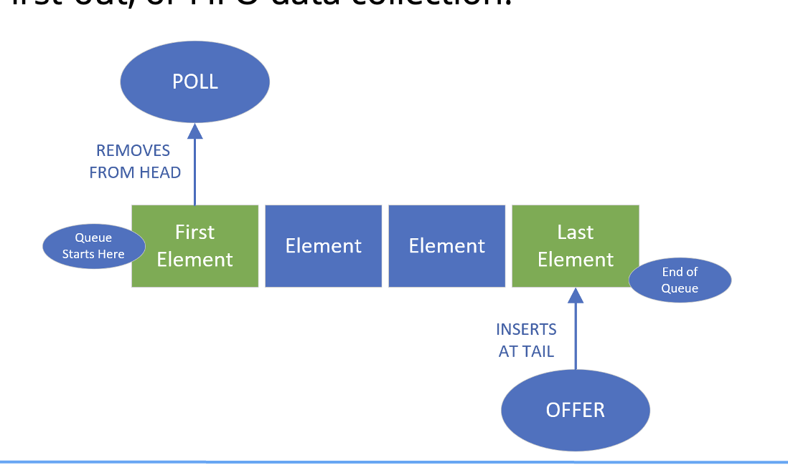
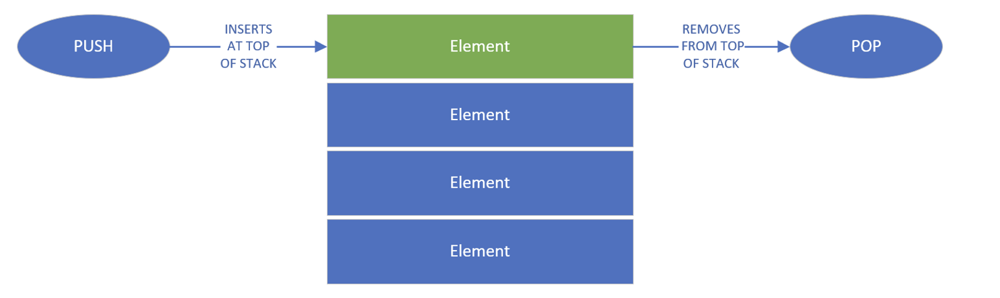

## LinkedList
We've just talked in detail about how to LinkeList, and the ArrayList, are different under the covers.

An ArrayList is implemented on top of an array, but a LinkedList is a doubly linked list.

Both implement all of List's methods, but the LinkedList also implements the Queue and Stsack methods as well.

## A Queue is a First-In, First-Out (FIFO) Data Collection
When we tink of a queue, we might think of standing in line.

When we get in a line or a queue, we expect that we'll be processed, in relationship to the first person in line.

If we want to remove an item, we poll the queue, getting the first elements or person in the line.

if we ant to add an item, we offer it onto the queue, sending it to the back of the line.

Single-ended queue always process elements from the start of the queue.

A double-ended queue allows access to both the start and end of the queue.

A LinkedList can be used a double ended queue.

## A Stack a is Last-In, First-Out (LIFO) Data Collection
When we think of a stack, we can think of a vertical pile of elements, one on top of another, as we show on this slide.

When we add an item, we push it onto the stack.

If we ant to get an item, we'll take the top item, or pop it from the stack.
