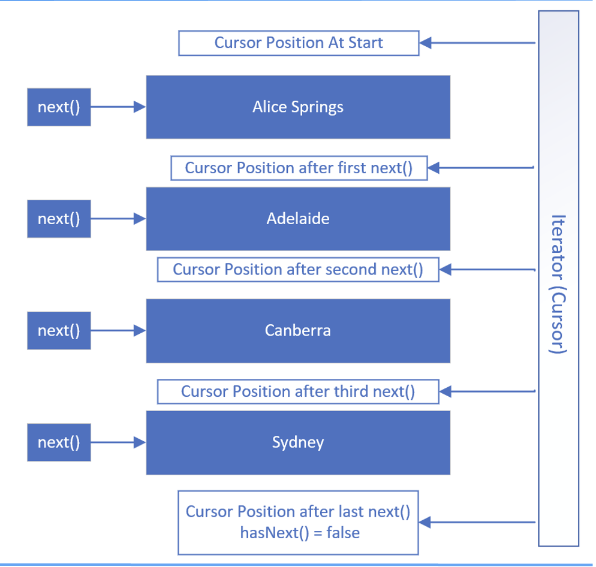

## What's an Iterator?

In a nutsell it's another way to traverse lists.

So far, we'ave mainly used for loops to traverse through elements in an rray of list.

There is the tradisional for loop and an index into a list.

And also, the enhanced for loop and a collection to step through the elements one at a time.

We'v used both quite a few times in the course.

## How does an Iterator work?
If we're familiar with databases, we might be familar with a database cursor, which is a mechanism that enables traversal over records in a database.

An iterator can be thought of as something similar to a database cursor.

Specifically, an iterator is an object that allows traversal over records in a collection.

The Iterator is pretty simple.

When we get an instance of an iterator, we can call the <b>next</b> method to get the next element in the list.

We can use the <b>hasNext()</b> method to check if any elements remain to be processed.


This slide shows visually how an Iterator works using the PlacesToVisit List.

WHen an iterator is first created, its cursor position is pointed at a position <b>before</b> the first element.

The first call to the <b>next</b> method retrieves the first element and moves the cursor position to be between the first and second elements.

Subsequent calls to the <b>next</b> method moves the iterator's positon through the list, as shown until there are <b>no element left</b>, meaning <b>hasNext = false</b>

At this point, the iterator or cursor position is below the last element.

## Iterator vs. ListIterator
And Iterator is forwards only and only supports the <b>remove</b> method.

An ListIterator allows us to navigate both forwards and backwards. Besides the remove method, it also supports the <b>add</b> and <b>set</b> methods, which function as we probably expect.

## Iterator position vs. Element positions
It's really important to understand that the iterator's cursor positions are <b>between</b> the element.

```java
var iterator = list.listIterator();

String first = iterator.next();     // Alice Springs returned, cursor moved to
                                    // Cursor postion 1

String second = iterator.next();    // Brisbane returned, cursor moved to
                                    // Cursor postion 2

// Reversing Directions
String second = iterator.next();    // Brisbane returned, cursor moved to
                                    // Cursor postion 1
```