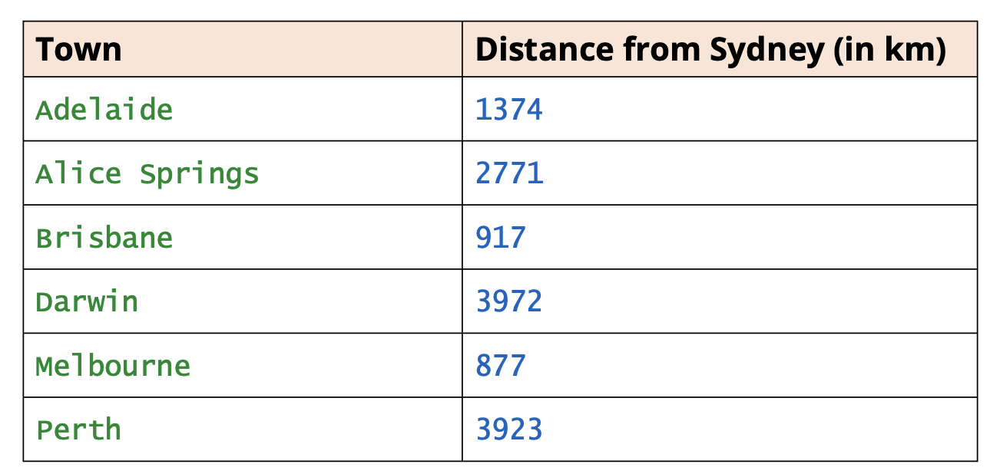
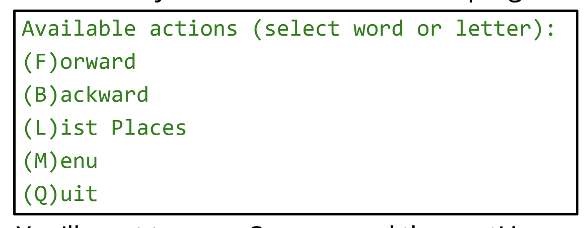

## LinkedList Challenge

I'm going to ask you to use LinkedList functionality to create a list of places, ordered by distance from the starting point.

I want you to use a ListIterator to move both backwards and forwards through this ordered itinerary of places.

First, create a type that has a field for a town or place name and a field for storing the distance from the start.

Next, create an itinerary of places or towns to visit, much like I've been doing in the last few videos.

But this time, instead of Strings, you'll want to create a LinkedList of your place or town type.

Here, I show a list of a few places in Australia and their distances from Sydney.

You'll create a LinkedList ordered by the distance from the starting point, in this case, Sydney.

Sydney should be the first element in your list.   

You don't want to allow duplicate places to be in your list for this data set.

In addition, you'll create an interactive program with the following menu item options.

You'll want to use a Scanner and the nextLine method to get input from the console.

You'll use a ListIterator to move forwards and backwards through the list of places on your itinerary.
