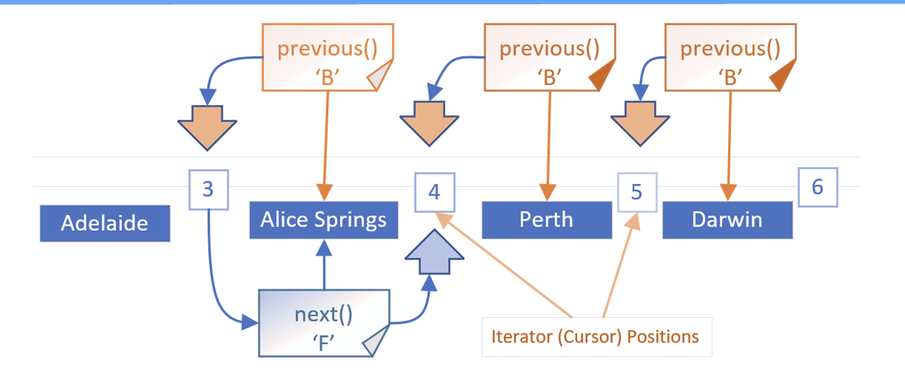

## Reversing Directions in a List Iterator

Here, the three B or back menu items, each calling the previous method.

This leaves our cursor position, shown as an orange arrow, positioned between Adelaide and Alice Springs.

When we decided to go forward, we called the next method from this cursor position and that gave us Alice Springs.

When we change directions, we have to compensate for the cursor being ahead of where we want it to be.

So, we have to make the call, either next or previous, twice. The first time to adjust the cursor, and the second time to get the element.