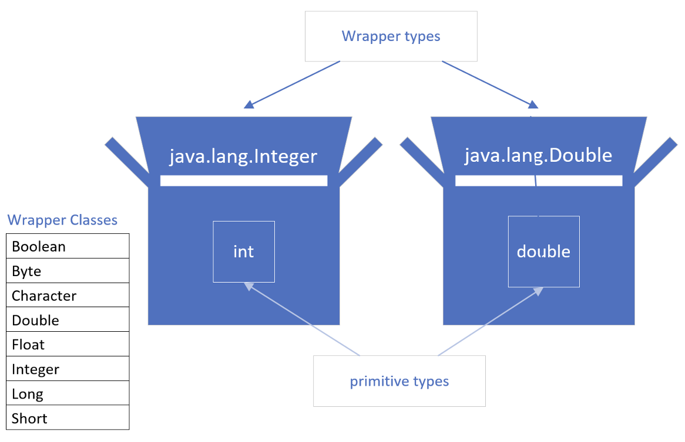

## Why does Java have primitve data types?
Some OOP languages don't support any primitive data types at all, meaning everything is an object.

But most of the more popular OOP languages of the day, including Java, support both primitive types and objects.

Primitive types generally represent the way data is stored on an OS.

Primitives have some adventages over objects, especially as the number of elements we need to store increase.

Objects take up additional memory and may require a little more processing power.

We know we can create object, with primitive data types as field types, for example, and we can also return primitive types from methods.s

When we look at classes like the ArrayList or the LinkedList, which we've reviewed in detail in the section, we find that these classes don't support primitive data types as a collection type.

In other words, <b>we can't do something like creating a LinkedList, using an int primitive type.

As an example the code below won't compile.

```java
LinkedList<int> myIntegers = new LinkedList<>();
```

This means, we can't take adventage of the great functionality that Lists provide, with primitive values. At least not directly.

More importantly, we can't easily use primitives in some of the features we'll be learning about the future, like generics.

But Java, as we have learned, does give us wrapper classes for each primitive type.

And we can go from a primitive to a wrapper, which is called boxing, or a wrapper to a primitive, which is called unboxing, with relative eas in Java.

## What is Boxing?


A primitive is boxed, or wrapped, in a containing class, whose main data is the primitive value.

Each primitive data type has a wrapper class, as shown the list, which we've seen before.

Each wrapper type boxes a specific primitive value.

## How do we box?
Each wrapper has a static overloaded factory method, valueOf, which takes a primitive as an argument and returns an instance of the wrapper class.

The code shown on this slide, returns an instance of the `java.lang.Integer` class, to the boxedInt variable, wiht the value 15.

```java
Integer boxedInt = Interger.valueOf(15);
```

## Deprecated Boxing using the wrapper constructor
Another manual of boxing, which we'll see in older code, is by creating a new instance of the wrapper class, using the nex keyword, and passing the primitive value to the constructor.

See this example below.

```java
Interger boxedInt = new Integer(15);
```

If we try this in IDE, with any Java version greather than JDK-9, IDE will tell us that this is deprecated code. And rightly so. 

## Deprecated Code
<b>Deprecated Code</b> means it's outdated code and is likely to not be supported in a future version. It's been marked for deletion from the language at some point in the future.

If we come across deprecated code, there is usually always a newer, better way to do what we are trying to achhieve, and we should use the new way.

## Using new (with a constructor) is depcrecated for wrappers
```java
Integer boxedInt = new Integer(15);
```
Java's own docs states the following about the code above:
- It is rarely appropriate to use this constructor.
- The static factory `valueOf(int)` is generally a better choice, as it is likely to yield significantly better space and time performance.

This deprecation applied to all the constructors of the wrapper classes, not just the Integer class.

In truth, we rarely have to manually box primitives, because Java supports somethingg called <b>autoboxing</b>.

## What is autoboxing?
Autoboxing is where Java automatically boxes a primitive type for us. Hence the term autoboxing.

Java makes it easy to assign a primitive to a wrapper variable, as shown below.

```java
Integer boxedInt = 15;
```

Java supports this syntax, and its actually preferred and easier to read as well.

Underneath the covers, Java is doing the boxing. In other words, an instance of Integer is created, and it's value is set to 15.

Allowing Java to autobox is preferred to any other method, because Java will provide the best mechanism to do it.s

```java
Integer boxedInteger = 15;

int unboxedInt = boxedInterger.intValue():
```

Every wrapper class supports a method to return the primitive value it contains.

This is called unboxing.

In the example on this slide, we've autoboxed the integer value 15, to a variable called boxedInteger.

This gives us an object which is an Integer wrapper class, with the value of 15.

To unbox this on an Integer class, we can use the `intValue` method to do it manually, which returns the boxed value, the primitive int in this case.

```java
Integer boxedInteger = 15;

int unboxedInt = boxedInterger.intValue():
```

Just like boxing, it's unnecessary to <b>manually unbox</b>

## Automatic unboxing
```java
Integer boxedInteger = 15;

int unboxedInt = boxedInterger:
```

Automatic unboxing is really just referred to as unboxing in most cases.

We can assign an instance of a wrapper class directly, to a primitive variable.

The code on this slide shows an example.

We're assigning an object instance to a primitive variable, in the second statement.

This is allowd, because the object instance is an Interger wrapper, and we're assigning it to an int primitive type variable.

Again, this is the preferred way to unbox a wrapper instance.

Let's get back to some code now and see different examples of autoboxing and unboxing in action.