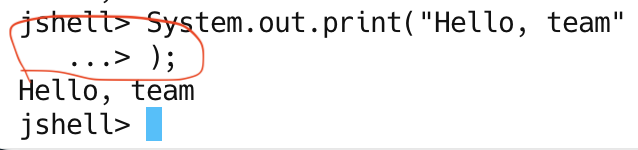
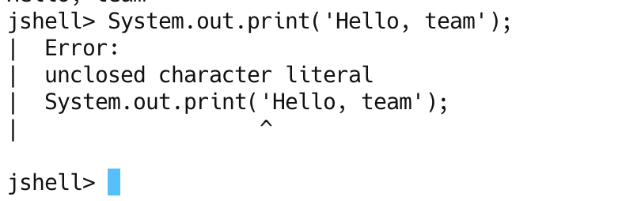

## Statement
What is a statement?
=> It's a complete command to be execute. It can include one or more expressions.

## Common Error
1. 

In the red circle, is an error that JShell assuming that we not finish typing yet.
 
2. 

For other programming languages such as: python or javascript replace the double to single quote
is work perfectly fine. 
But in java it's not valid and we will get an error.