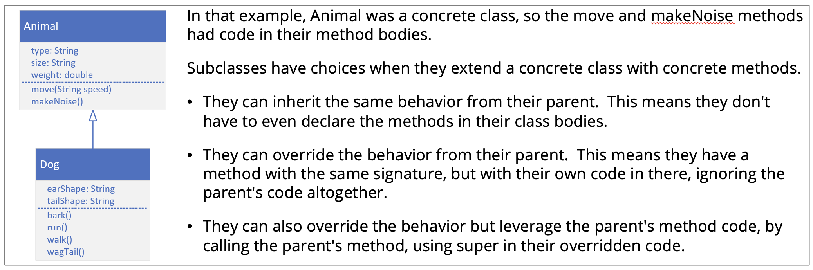

## Abstraction - What is it?
Now consider these sentences.
- We adopted a new pet this weekend.
- We ordered something we really wanted from the store.
- We bought a ticket and won a prize.
If we said any of these things to a friend or coworker, it might be frustrating for them.

We haven't given them enough information in each of these cases.

They can't visualise what we are talking about, because they lack details. Which we didn't provide.

On the other hand, when we talk about <b>groups of things</b>, we don't usually need too many specifies.

Consider these sentences.

We need to get home to feed the animals.

We're waiting for my box of stuff from an online store to be delivered.

So here, animals, and stuff are probably enough information, to fully describe the situation.

## The abstract class
The abstract class is declared with. the <b>abstract</b> modifier.

Here we declare an abstract class called Animal.

```java
abstract class Animal { }   // An abstract class is declared with the abstract
                            // modifiers.
```

An <b>abstract</b> class is a class that's <b>incomplete</b>.

We can't create an instance of an abstract class..

```java
Animal a = new Animal(); // INVALID, an abstract class never gets instantiated
```

An abstract clas can still have a constructor, which will be called by its subclasses during their constuction.

An abstract class's purpose is to define the behavior its subclasses are required to have, so it always partipicates in <b>inheritance</b>.

For the examples on this slide, assume that Animal is an abstract class.

Classes extend abstract classes and can be concrete.

Here, Dog extends Animal. Animal is abstract, but Dog is concrete.

```java
class Dog extends Animal {} // Animal is abstact, Dog is not
```

A class that extends an abstract class can also be abstract itself, as we show with this next example.

Mammal is declared abstract, and it extends Animal, which is also abstract.

```java 
abstract class Mammal extends Animal {} // Animal is abstract, Mammal is also
                                        // abstract
```

And finally an abstract class can extend a concrete class.

Here we have BestOfBreed, an abstract class, extending Dog, which is concrete.

```java
abstract class BestOfBreed extends Dog {}   // Dog is not abstract, but
                                            // BestOfBreed is
```

## What's an abstract method?

An abstract method is declared with the modifier <b>abstract</b>.

We can see on this slide, that we're declaring an abstract method called move with a void return type.

It simply ends with a semi-colon.

It doesn't have a body, not even curly braces.

```java
abstract class Animal {
    public abstract void move();
}
```

Abstract methods can only be declared on an abstract class or interface.

## What good is an abstract method, if it doesn't have any code in it?
An abstract method tells the outside world that all Animals will move, in the example.
```java
abstract class Animal {
    public abstract void move();
}
```

Any code that uses a subtype of Animal, knows it can call the move method, and the subtype will implement this method with this signature.

This is also true for a concrete class, and a concrete method that's overriden.

We might be askin, what' the difference, and when would we use an abstract class.

## Animal and Dog Class Diagram from our Inheritance example
In the videos on <b>inheritance</b>, we created a very basic Animal class, and then we extended it to create a Dog.


