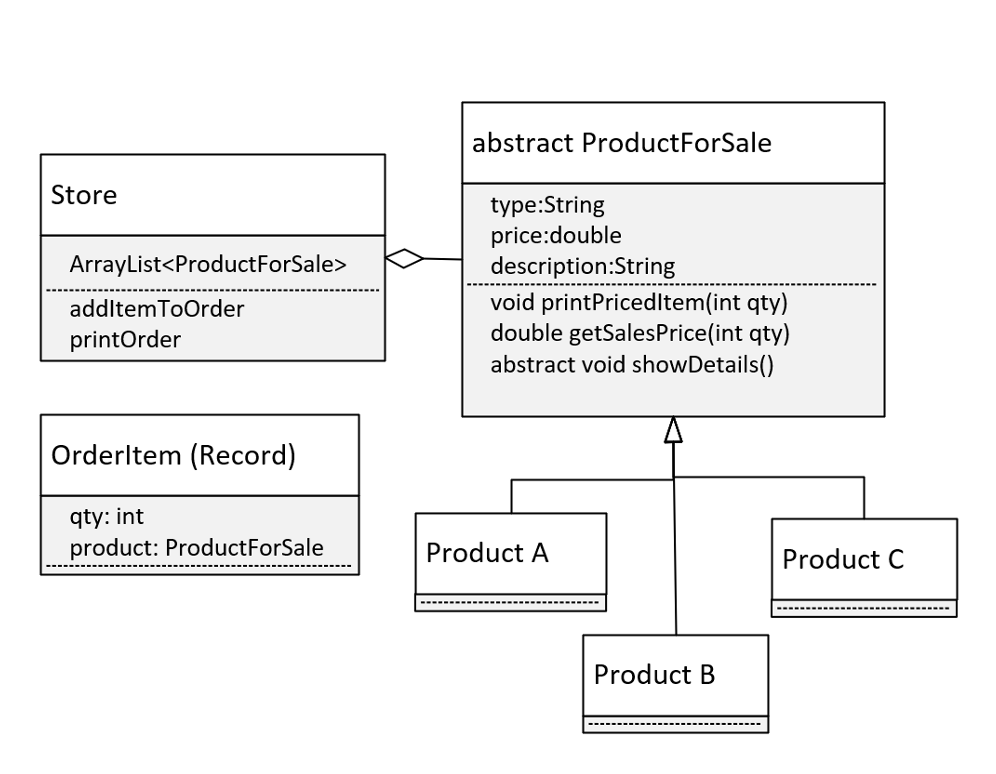

## Abstract Class Challenge
In this challenge, you need to build an application that can be a store front for any imaginable item for sale.

Instead of the Main class we usually create, create a Store class with a main method. 

The <b>Store</b> class should:

- manage a <b>list of products for sale</b>, including displaying the product details.
- manage an order, which can just be a <b>list of OrderItem</b> objects.  
- have methods to <b>add an item to the order</b>, and <b>print the ordered items</b>, so it looks like a sales receipt.

Also create a <b>ProductForSale</b> class that should have at least three fields: a <b>type, price,</b> and a <b>description</b>. This class should also have methods to:
- getSalesPrice, a <b>concrete method</b>, which takes a <b>quantity</b>, and <b>returns the quantity times the price.</b>
- printPricedItem, <b>a concrete method</b>, which takes a <b>quantity</b>, and should <b>print an itemized line item for an order, with quantity and line-item price.
- showDetails, an <b>abstract method</b>, which represents what might be <b>displayed</b> on a product page. <b>Product type, description, price</b>, and so on.

Also create an <b>OrderItem</b> type, that has at a minimum 2 fields, <b>quantity</b> and a <b>Product for Sale</b>.
You should also create two or three classes that extend the ProductForSale class, that will be products in your store.

## The Design
Let's look at my approach.

Here is the class diagram of what you'll be building.

This covers all the requirements I talked about.

Notice I'm specifying that OrderItem will be a record.  This is just to keep the code simple.

I'm not really specifying what our store products are, you can really put anything there.

