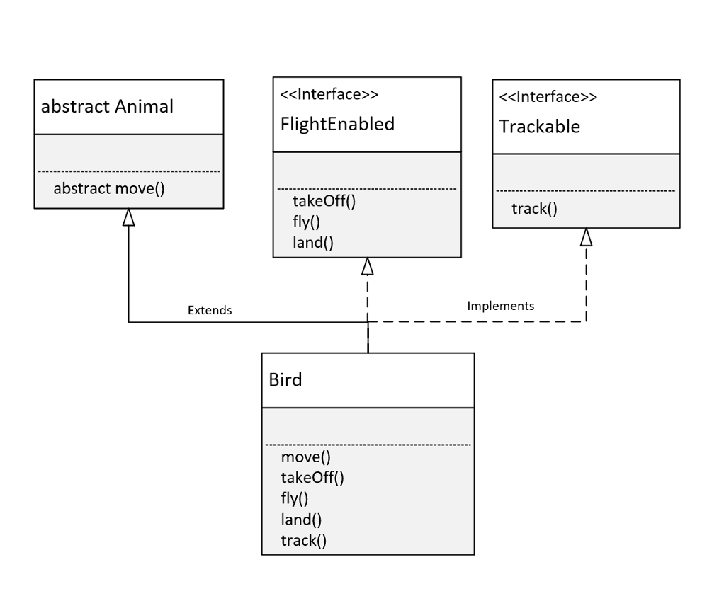
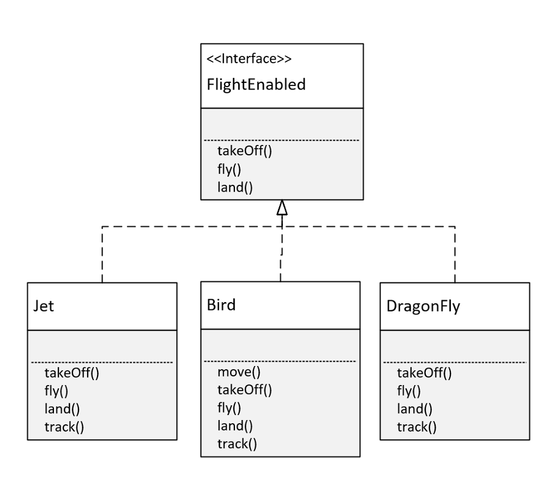

## The Bird Class

An interface lets us treat an instance of a single class as many different types.

The Bird Class inherits behavior and attributes from Animal, because I used the extends keyword in the declaration of Bird.

Because the move method was abstract on Animal, Bird was required to implement it.

The Bird Class implements the FlightEnabled interface. 

This required the Bird class to implement the takeOff, fly, and land methods which were the abstract methods on FlightEnabled.

The Bird Class also implements the Trackable interface. 

This required the Bird class to implement the track method, which was the abstract method declared on Trackable.

Because of these declarations, any instance of the Bird class can be treated as a Bird.

This means it has access to all of Bird's methods, including all those from Animal, FlightEnabled, and Trackable.

An instance of Bird can be treated like or declared as an Animal, with access to the Animal functionality described in that class, but customized to Bird.

It can be used as a FlightEnabled type, with just the methods a FlightEnabled type needs but again customized for the Bird.

Or it can take the form of a Trackable object, and be tracked with specifics for the Bird class.

## The FlightEnabled Interface

Interfaces let us take objects that may have almost nothing in common, and write reusable code so we can process them all in a similar manner.

On this slide, you can see that a Jet, a Bird, and a DragonFly are very different entities.

But because they implement FlightEnabled, we can treat them all as the same type, as something that flies, and ignore the differences in the classes.

Interfaces allow us to type our objects differently, by behavior only.

## The final modifier in Java
When we use the final modifier, we prevent any further modifications to that component.
- a finle method means it can't be overriden by a subclass.
- a final field means an object's field can't be reassigned or given a different value after its initialization.
- a final static field is a class field that can't be reassigned or given a different value after the class's initialization process.
- a final calss can't be overriden, meaning no clas can use it in the extends clause.
- a final variable in a block of code, means that once it's assigned a value any remaining code in the block can't change it.
- a final method parameter means we can't assign a different value to that parameter in the method code block.

The final static field, is what we're really creating, when we declare a field on an interface.

## Constatns in Java
A constnt in Java is a variable that can't be changed.

A `Constant variable` is a final variable of primitive type, or type String, that is initialized with a constant expression.

Constants in Java are usually named with <b>all uppercase letters and with underscores between words</b>

A static constant means we access it via the type name.

We saw this with the `INTEGER.MAX_VALUE`, and the `INTEGER.MIN_VALUE` field

## A field declared on an Interface is always public, static and final 
Java lets us specify these like an ordinary field on an interface, which might be kind of confusing and misleading to a new Java programmer.

But we can declare them with any combination of those modifiers, or none at all with the same result.

These all mean the same thing on an interface.

```java
double MILES_TO_KM = 1.60934;
final double MILES_TO_KM = 1.60934;
public final double MILES_TO_KM = 1.60934;
public static final double MILES_TO_KM = 1.60934;
```
