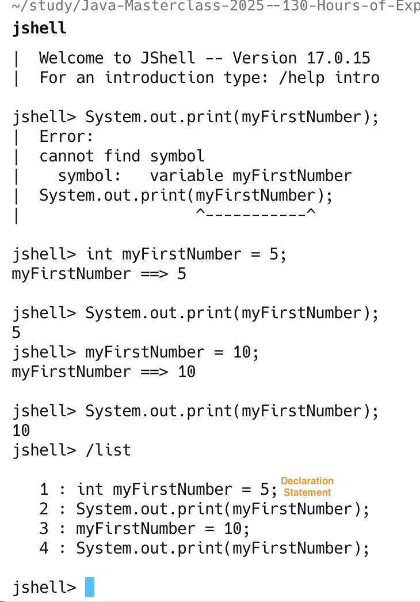
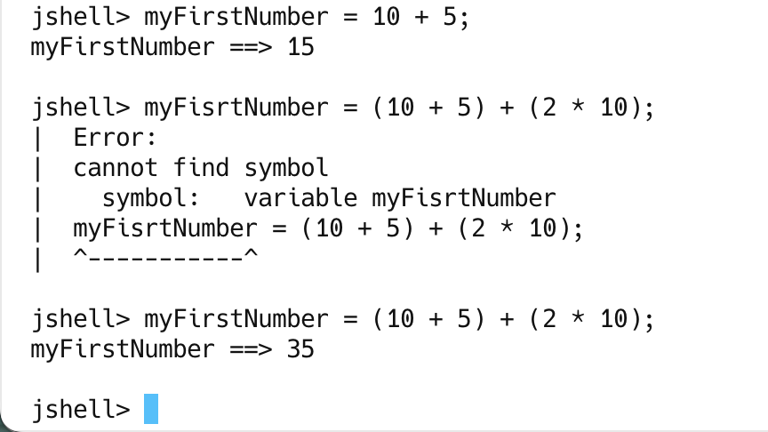

# Variable
Variable are is a way to store information in our computer. 
Variable that we define in the program, can be accessed by a name we given them,
and the computer does the hard work, of figuring out where they get stored in the computer's RAM.

## Keyboard
A keyword is any one of a number of reserved words, that have a predefined meaning in 
the java language.

In Java syntax, all code is case-sensitive, and this includes keywords.
Keywords link: https://docs.oracle.com/javase/specs/jls/se17/html/jls-3.html#jls-3.9

## Data Types
A declaration statement is used to define a variable by indicating a data type, and name,
then optional to set the variable to a specific value.

## Expression
An expression is a coding construct, that evaluates a single value.

## Challenge_1

Look at creating a new System.out.print below the declaration for myFirstNumber, 
and to see if you can figure out how to print out the value of the my FirstNumber variable.

## Variable Declarations in JShell
By declaring a variable again, we are effectively re-declaring a variables,
and in normal java programming, that would not be allowed, and would throw error.

Due to its interactive nature, JShell "hold our hand", and allows the redeclaration 
to occur without throwing an error.

NOTE: `We can assign a value to variable multiple time in java, but it's the declaration
(which includes the data type) that cannot normally be done a second time for the same variable.`

## Operators

Java operators, or just operators, perform an operation (hence of term) on a variable or value.
Addition, Subtraction, Division, Multiplication.   

