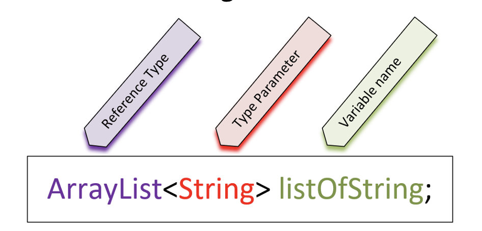

## What are Generics?
Java supports generic types, such as classes, records and interfaces.

It also supports generic methods. Sound confusing?

## Declaring a Class vs. Declaring a generic Class
On this slide, a regular class declaration, next to a generic class.

THe thing to notice with the generic class, is that the class declartion has angle brackets with a `T `in them, directly after the class name.

`T` is the placeholder for a type that wil be specified later.

This is called a type identifier, and it can be any letter or word, but `T` which is short for Type is most commonly used.

For the generic class, the field's type is that placeholder, just `T`, and this means it can be any type at all.

The `T` in the angle brackets means it's the same type as the `T`, specified as the type of the field.

| Regular Class |
| - |
```java
class ITellYou {
    private String field;
}
```
| Generic Class |
| - |
```java 
class YouTellMe<T> {
    private T field;
}
```

## Using a generic class as a reference type
On this slide, we have a variable declaration of the generic ArrayList class.

In the declaration of a reference type that uses generics, the type parameter is declared in angle brackets.

The reference type is ArrayList, the type parameter (or parameterized type) is String, which is declared is angle brackets, and listOfString is the variable name.

Many of Java's libraries are written using generic classes and interfaces, so we'll be using them a lot moving foreward.

It's still a good idea to learn to write our own generic class though, to help we understand the concept.



