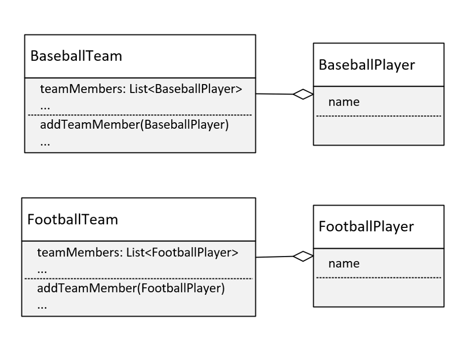
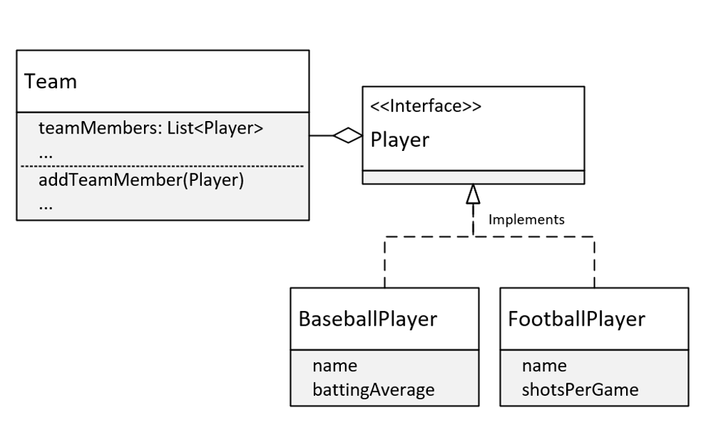

## Solution 1: Duplicate code

I could copy and paste the BaseballTeam, and rename everything for FootballTeam, and create a FootballPlayer, as I'm showing on this slide.

This means I'd have to make sure any changes I make to one team or player that made sense for the other team and player, had to be made in both sets of code.

This is rarely a recommended approach, unless team operations are significantly different.

## Solution 2: Use a Player interface or abstract class to support different types of players

I could change Baseball team to simply Team and use an interface type (or either an abstract or base class) called Player.

On this slide, I show a Team Class and on this class the members are a List of Players.

I've made Player an interface and have BaseballPlayer and FootballPlayer classes that implement that interface.

This is a better design than the previous one, but it's still got problems.

## Generic Type Parameters
We've already shown that one way to declare a generic class, is to incldue a type parameter which we show here, in the angle brackets.
```java
public class Team<T>{
```

Now, using `T` is just a convention, short for whatever type we want to use this Team class for.

But we can put anything we want in there.

Single letter types are the convention however, and they're a lot easier to spot in the class code, so we encourage to stick to this convention 

We have more than one type parameters, so we could have T1, T2, and T3, etc.
```java
public class Team<T1, T2, T3> {}
```

Convention says that instead of using type parameters like this, it's easier to read the code with alternative letter selections.

And these are usually S, U, and V, in that order.

So, if we had three types, we'd probably want to declare this class as shown here, with T, S, and U,
```java
public class Team<T, S, U> {}
```

A few letters are reserved for special use cases.

The most commonly used type parameter identifiers are:
- E for element (used extensively by the Java Collections Framework).
- K for Key(used for mapped types).
- N for Number
- T for type.
- V for Value.
- S, U, V etc. for 2nd, 3rd, 4th types.

## Raw usage of generic classes.
When you use generic classes, either referencing them or instantiating them, it's definitedly recommended that we include a type parameter.

But we can still use them without specifying one. This called the <b>Raw Use</b> of the reference type.

The raw use of these classes is still available for backwards compatibility, but it's discouraged for several reasons.
- Generics allow the compiler to do compile-time type checking when adding and processing elements in the list.
- Generics simipify code, because we don't have to do our own type checking and casting, as we would if the type of our elements was Object.