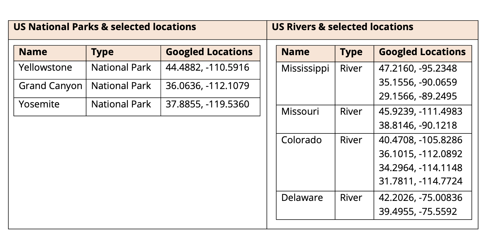
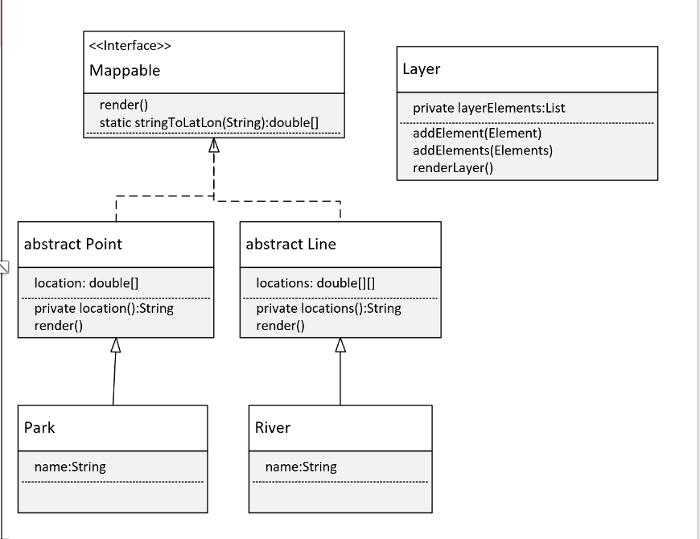

## Generic Class Challenge

In the Interface Challenge, we created a Mappable Interface and introduced you to different Map geometry types, POINT, LINE, and POLYGON.

The challenge then created a map marker or icon, and a map label, but didn't do anything with locations.

In this challenge, you'll use another Mapping example, but use location data in the output.

As you are probably aware, you can use Google Maps to determine the location of any point on a map.

## The Generic Class challenge

We'll start with a <b>Mappable Interface</b> that has one abstract method called render.

We'll create two classes <b>Point</b> and <b>Line</b>, that implement this interface.

We'll also create <b>two specific classes</b> that extend each of these, for a mappable item of interest.


In this solution, we'll be mapping US National Parks and a couple of major rivers in the US. The parks will be points and the rivers will be lines.

The data I'll be using is shown here.

I'll be creating a <b>Park</b> class that extends Point, and a <b>River</b> class that extends Line, to support this data.

You should have constructors or methods to support adding a couple of attributes, and some location data to your two specific classes.

| Name | Googled Location of a Point |
| - | - |
| Yellowstone National Park | 44,4882, -110.5916 |

We can pass the location data of a point type, as a String, or a set of double values, representing latitude and longitude.

We can pass the multiple locations of a line, as a set of strings, or a two-dimensional array of doubles that represents the multiple points on your line.

| Name | Googled Location of a Point |
| - | - |
| Mississippi River | 47.2160, -95.2348<br>35.1556, -90.0659<br>29,1566, -89.2495 |

In addition to these classes, we'll create a <b>generic class</b> called <b>Layer</b>.

Our Layer class should have <b>one type parameter</b> and should only <b>allow Mappable elements</b> as that type.

This generic class should have <b>a single private field</b>, a <b>list of elements</b> to be mapped.   

This class should have a method or constructor, or both, to add elements.

We should create a method, called renderLayer that loops through all elements and executes the method render on each element.

Our main method should create some instances of your specific classes that include some location data.

These should get added to a typed Layer, and the renderLayer method called on that.

Sample output is shown here:

```java
Render Grand Canyon National Park as POINT ([40.1021, -75.4231])
Render Mississippi River as LINE ([47.2160, -95.2348], [29,1566, -89.2495], [35.1556, -90.0659])
```
## The plan -  the class diagram
This diagram shows how I plan to build this.
You can see my Mappable interface has the method render on it, and by default that's both public and abstract.
I've also added a static method that will take a String, and split it into a double array, which will have the latitude and longitude values in them.
I've made two classes, Point and Line, abstract because I don't really want anyone to instantiate these classes. 
Point has a location field, which is a double array, and will just have two doubles the latitude and longitude.

