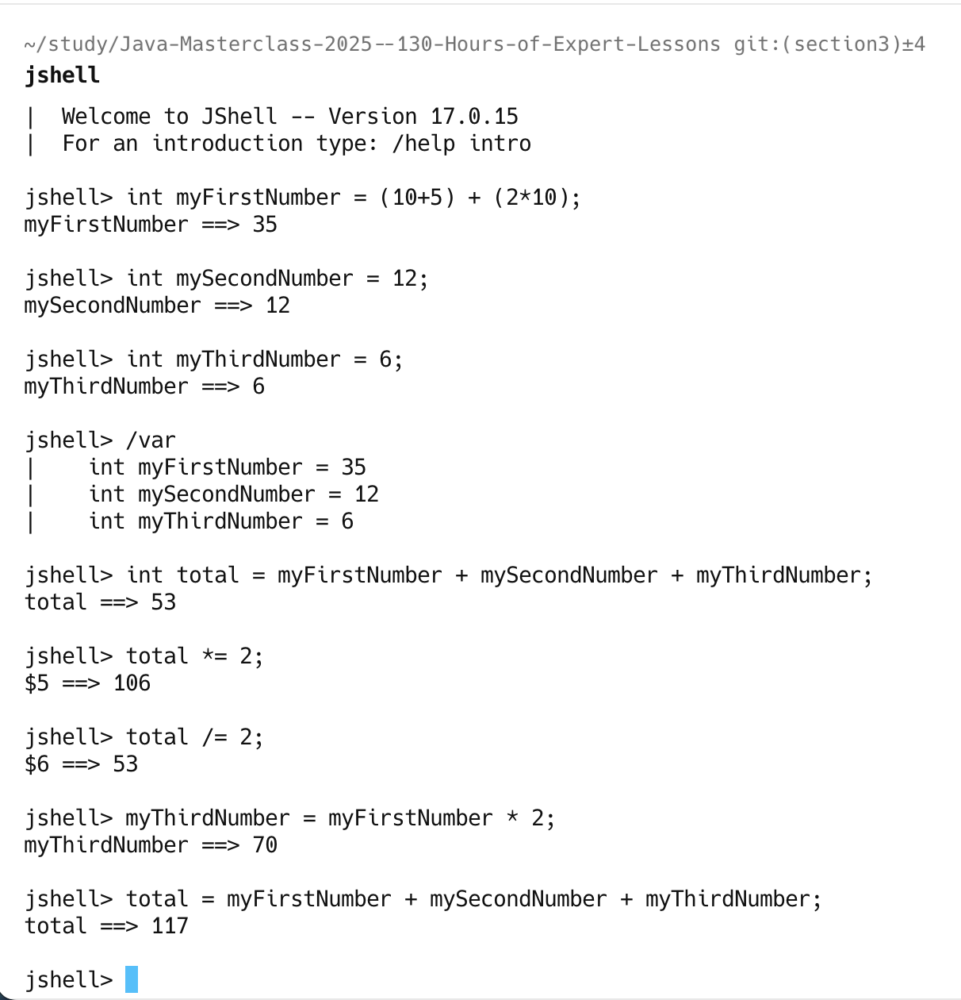
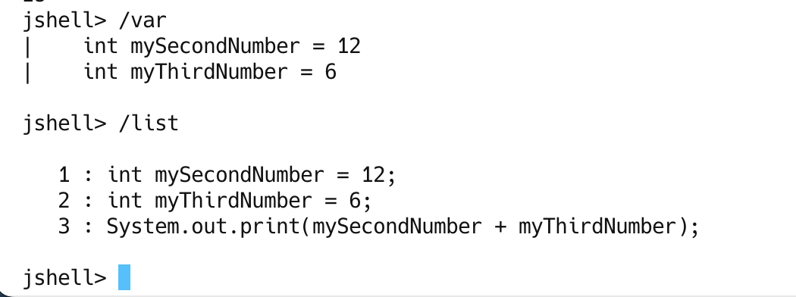
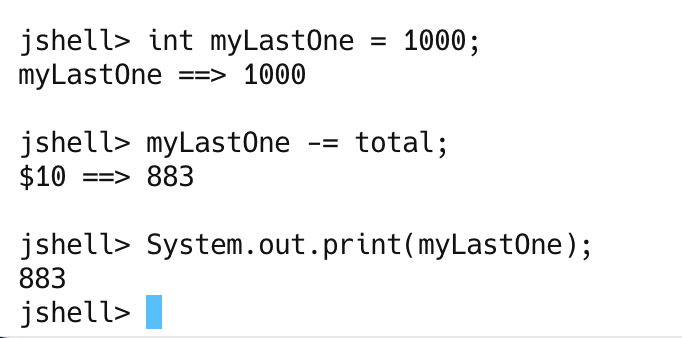
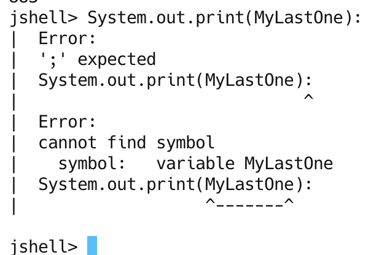

## Challenge 1

create two additional in JShell
Here what's we need:
- One variable called mySecondNumber, which is an int, with a value of 12.
- And another variable called myThirdNumber, also of type int, with a value of 6. 
### Result:

### CMD: list all variable and all statement

## Challenge 2

Create a new variable and call it myLastOne;
- Its data type should be int.
- it should be set a value of 1000, minus (or less than)the value in the total variable.
- Next print out the value of the myLastOne variable on the line after you declare it.
Hint: use another operator haven't use in previous video

## Java code is case sensitive
`Java code is case sensitive.
This includes not only keywords and language syntax, but variable names and data types as well.`

`myLastOne is not the same variable as MyLastOne with a capital M.
int in lowercase, is not the same as Int with the first letter capitalized, or INT, 
all in uppercase, etc.`

`Keywords need to be in lowercase.
And variables will always be extactly as you declare them, including capitalization.
Remember that case matters in Java code!
The /vars command line in JShell can help you identify any misspellings you may have made.`

### Summary: In this video:
`We used expressions to assign values to our variables, and we used variables we created, 
in expressions.`
