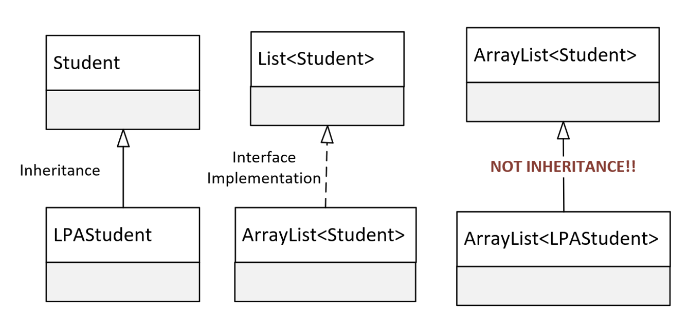

## What's left to know about Generics?
In the new few videos, we will cover the following topics.
- Uising generic references that use type arguments, declared in method paramters and local variables.
- Creating generic methods, apart from generic classes.
- Using wildcards in the type argument.
- Using multiple upper bounds.

## This isn't inhertice

We know LPAStudent inherits from Student, and we can pass an instance of LPAStudent to any method, or assign it to any reference type, declared with the type of Student.

We also know that ArrayList implements List, and we can pass an ArrayList to a method or assign it to a reference of the List type, and we saw this in both cases for our Student ArrayList.

But why can't we pass the an ArrayList of LPA Student, to the method paramter that's declared as a List of Student?

Surely, if an LPAStudent is a Student, a List of LPAStudent is ultimately a List of Student.

It's very natural to assume that a method that takes a List witht Students should accept a List with LPAStudents, because LPAStudent is a Student after all.

But that's not how it workds.

When used as reference types, a container of one type has no relationship to the same container of another type, even if the contained types do have a relationship.