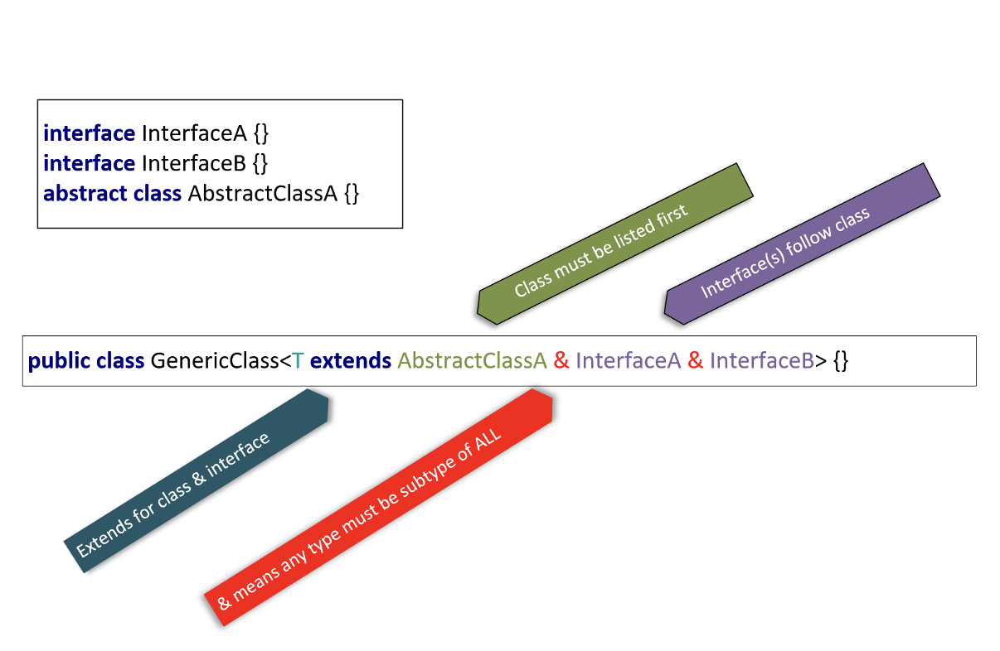

## Using Multiple types to declare an Upper Bound 

We can use multiple types to set a more restrictive upper bound with the use of an ampersand between types.

The conditions require a type argument to implement all interfaces declared, and to be subtype of any class specified.

We can extend only one class at most, and zero to many interfaces.

We use extends for either a class or an interface or both.

If we do extend a class as well as an interface or two, the class must be the first type listed.