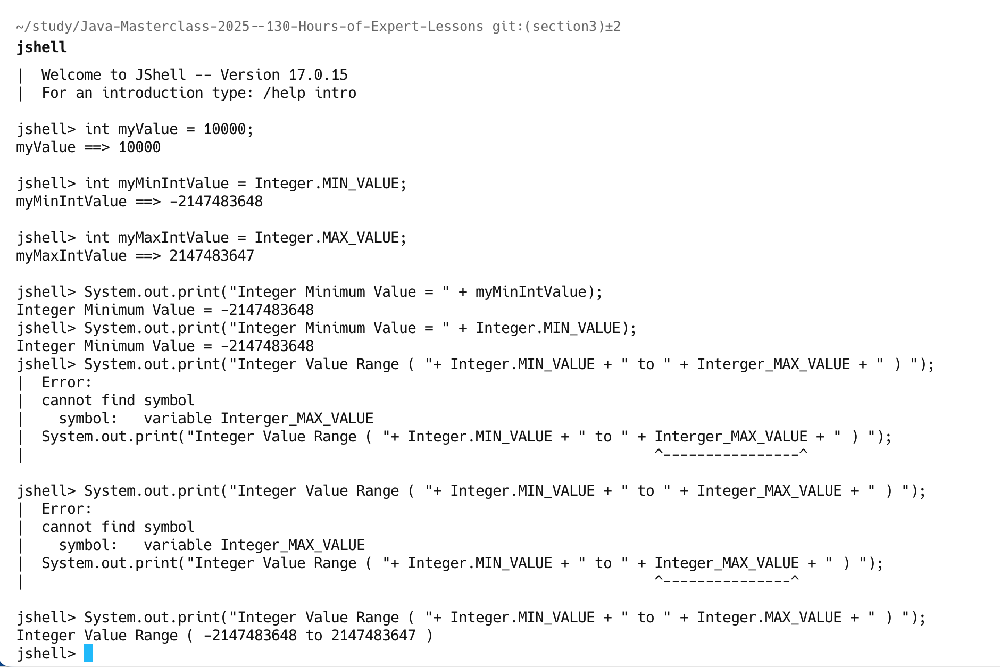
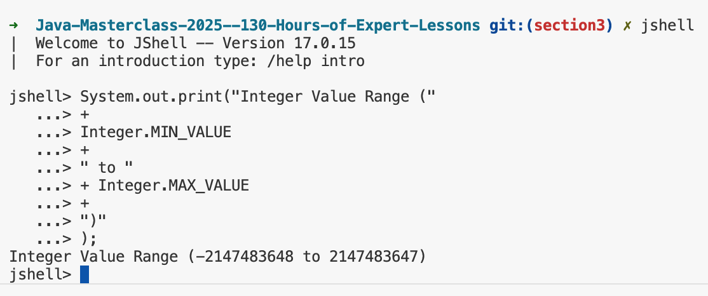
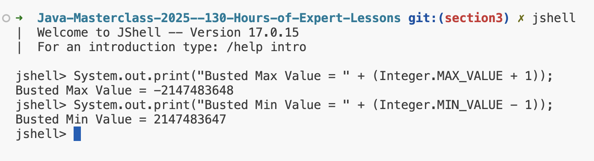
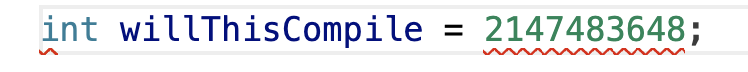
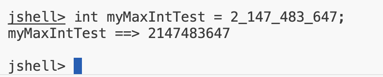

## 1. Java's Primitive Type
Primitive type are the most basic data types.
The eight primitive types in Java are shown in below; 
 

| Whole Number | Real number (floating pointor decimal)|
| -- | -- |
|byte|float|
|short|double|

| Single character | Boolean value |
| -- | -- |
| char | boolean |

`Consider these above types as the building blocks of data manipulation.Remember that primitive data types are simply placeholders in memory for a value.`

## Integer
An integer is a whole number, meaning it dones't contain a fractional element, or a decimal.

### Sample
Sample 1

Sample 2

## Class
A class is a building block for object-oriented programming, and allows us to build custom data types.

## Wrapper Class
`Java uses the concept of a wrapper class, for all of its eight primitive data types.`

A wrapper class provides simple operations, as well as some basic information about the primitive data type, which cannot be stored on the primitve itself.

We saw that MIN_VALUE, and MAX_VALUE, are elements of this basic infomration, for the int data type.

| primitive | Wrapper class |
| -- | -- |
| byte | Byte |
| char | Character |
| short | Short | 
| int | Integer |
| long | Long |
| float | Float |
| double | Double |
| boolean | Boolean |

## The Integer Wrapper Class
We were able to use MIN_VALUE, MAX_VALUE, on the wrapper class Integer.

<code>int myMinIntValue = Integer.MIN_VALUE;
int myMaxIntValue = Integer.MAX_VALUE;</code>

## Overflow and Underflow in Java
- if we try and put a value larger than the maximum value into an int, we'll create something called an Overflow situation.
- And similarly, if we try to put a value smaller than the minimum value into an int, we cause an Underflow to occur.

`These situation are also known as integer wraparounds.`

`The maximum value, when it overflows, wraps around the minimum value, and just continues processing without an error.`

`The minimum value, when it underflows, wrap around to the maximum value, and continues processing.`

## When will you get an overflow? When will you get an error?

There are two more examples that will compile, and result in an overflow. The second example may be surprising. Even though we are using numeric literals in the expression, the compiler still won't try to evaluate this expression, and the code will compile, resulting in an overflow condition.

<code>int willThisCompile = (Integer.MAX_VALUE + 1);</code>
<code>int willThisCompile = (2147483647 + 1);</code>

- if we assign a numeric literal value to a data type that is outside of the range, the compiler <b>DOES give you an error.</b> We looked at a similar example previously.

## What does an underscore mean in a numeric literal?
In java, you cannot put commas in a numeric literal. For example, the following is not valid syntax.

<code>int myMaxIntTest = 2,147,483,647;</code>
<code>int myMaxIntTest = 2_147_483_647;</code>

`We can put the underscore anywhere you might want a comma, but you can't use an underscore at the start or end of the numeric literal.`

