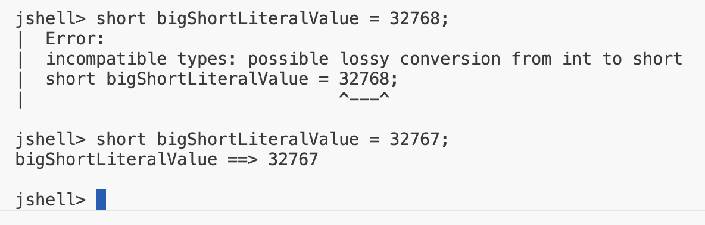

## byte, short, int, long
| Whole number primitive Data Type | Wrapper class | What's noteworthy |
| -- | -- | -- |
| byte | Byte | Has the smallest range |
| short | Short | |
| int | Integer | Java's default datatype for whole numbers|
| long | Long | Has the largest range |

## The byte data type
`The minimum value of a byte is -128.
The maximum value of a byte is 128.
Given its small range, you probably won't be using the byte data type much.
The byte wrapper class is the Byte with a capital B.`

## byte and short overflow/underflow
`Both the byte and the short, have the same overflow and underflow issue as the int data type has, but obviously with their range of numbers.`

## Size of Primitve Types and Width
Size, or Width, is the amount of space that determines (or limits) the range of values.

| Data Type | Width (int bits) | Min Value | Max Value |
| -- | -- | -- | -- |
| byte | 8 | -128 | 127 |
| short | 16 | -32768 | 32767 |
| int | 32 | -2147483648 | 2147483647 |

A byte, can store 256 numbers and occupies eigh bits, and has a width of 8.
A short, can store a large range of numbers and occupies 16 bits, and has a width of 16.
A int, can store a large range of numbers and occupies 32 bits, and has a width of 32.

## Using a numeric literal character suffix

The number 100, by default, is an int.

Java allows certain numeric literals to have a suffix appended to the value, to force it to be a difference data type from the default type.

The long is one of these and it's suffix is an 'L'.

this is one of the few instances Java is not case sensitive, a lowercase 'l' or an upercase 'L' at the end of a whole number mean the same thing - the number is a Long.

## How big is the difference between an int and a long?
How big is the difference, in the range of values that a long can store, compared to the int?
From this table, that the difference is quite significant.

| Data Type | Width (int bits) | Min Value | Max Value |
| -- | -- | -- | -- |
| int | 32 | -2147483648 | 2147483647 |
| long | 64 | -9223372036854775808 | 9223372036854775807 |

## When is L required?

<b>Problem</b>

In above expression <code>long bigLongLiteralValue = 2_147_483_647_234</code>, java still consider that value assign as integer.

A numeric literal that exceeds Integer.MAX_VALUE must use the 'L' suffix.

We cannot create a numeric literal in Java, that exceeds Integer.MAX_VALUE, without using the 'L' suffix, we'll always get the error <b>'integer number too large'</b>.

<b>Solution</b>

<b> Java Type Convertion Detection</b>

