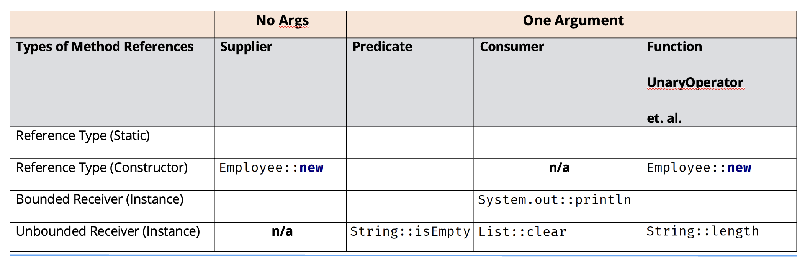
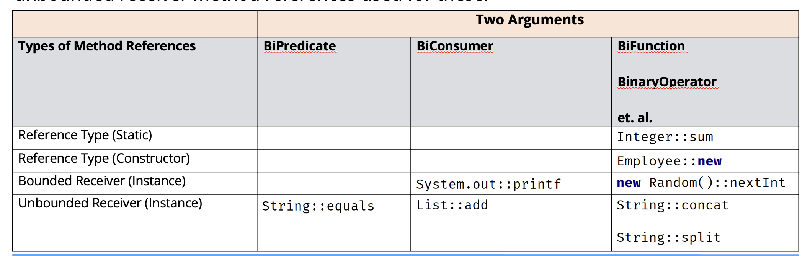

## Some Terminology for the next couple of Slides
A Type Reference refers to a class name, an interface name, an enum name, or a record name.

Static methods are usually called using Type References but can also be called by instances in our code.

This is NOT true for method references.

Static methods, in method references and lambda expressions, must be invoked using a reference type only.

There are two ways to call an instance method.

The first is when we refer to the method with an instance derived from the enclosing code.

This instance is declared outside of the method reference.

The System.out::println method reference is an example of this.

We'll find that some web sites call this instance a Bounded Receiver, and we actually like that terminology as differentiator.

A Bounded Receiver is an instance derived from the enclosing code, used in the lambda expression on which the method will be invoked.

The second way to call an instance method is where the confusion starts.

The instance used to invoke the method will be the first argument passed to the lambda expression or method reference when executed.

This is known in some places as the Unbounded Receiver.

It gets dynamically bound to the first argument, which is passed to the lambda expression when the method is executed.

Unfortunately, this looks an awful lot like a static method reference using a reference type.

This means there are two method references that resemble each other but have <b>two very different meanings</b>.

The first actually does call a static method and used a reference type to do it.

We saw this earlier, when we used the sum method on the Interger wrapper class.

```java
Integer::sum
```

This is Type Reference(Integer is the type), which will invoke a static method.

This is easy to understand.

But there is another, which we'll see when we start working with String method references in particular.

Here, we show a method reference for the concat method on String.

```java
String::concat
```

Now, we know by now we hope that the concat method, isn't a static method on String. It's an instance method that is called on a specific String object.

So why is this method reference even valid?

We could never call concat from the String class directly, because it needs to be called on a specific instance.

Instance methods can't be called using Reference Types.

But the example shown here, is a special syntax, when it's declared in the right context, meaning when it's associated to the right type of interface.

```java
String::concat
```

This is valid when we use a method reference in the context of an <b>unbounded receiver</b>.

Remember, the unbouned receiver means that the first argument becomes the instance used on which the method gets invoked.
```java
String::concat
```

Any method reference that uses `String::concat`, must be in the context of a two-parameter functional method.

The first paramater is the String instance on which the concat method gets invoked, and the second argument is the String argument passed to the concat method.

## Four Types of Method References
This chart shows the four different types of method references, with method reference examples, and a corresponding lambda expression.

| Type | Syntax | Method Reference Example | Corresponding Lambda Expression |
| - | - | - | - |
| static method | className::staticMethodName(p1, p2, ... pn) | Integer::sum | (p1, p2) -> p1 + p2 |
| instance method of a particular (Bounded) object | ContainingObject::instanceMethodName(p1, p2, ... pn) | System.out::println | p1 -> System.out.println(p1) |
| instance method of an arbitrary (Unbounded) object (as determined by p1) | ContainingType[=p1]::instanceMethodName(p2, ... pn) | String::concat | (p1, p2) -> p1.concat(p2). |
| constructor | ClassName::new | LPAStudent::new | () -> new new LPAStudent() |

## Method Reference Example (No arguments and one argument)
This chart shows some of the valid ways to use method references when assigned to different interface types.

These interface types have no arguments in the case of a Supplier, and one argument for the other interfaces.

If a cell is empty, it's not because it's not valid, but because are many possiblities.

n/a means not applicable, so a `Supplier` or any interface method that has no arguments, can never be a target for the unbounded receiver type of method reference.



## Method Reference Examples (Two Arguments)
This chart shows some of the valid ways to use method references when assigned to differnt interface types.

These interface types have two arguments, and therefore it's more common to see the unbounded receiver method references used for these.
