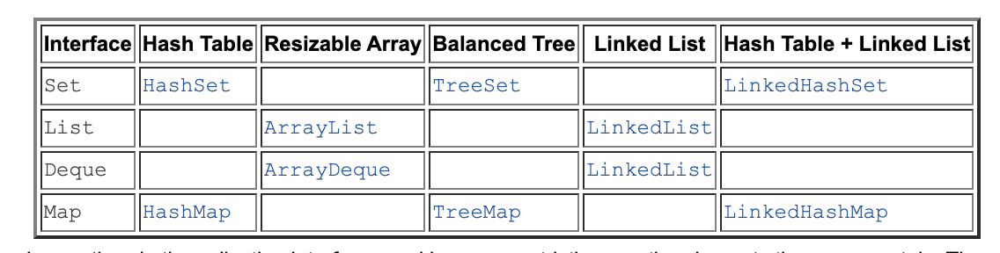
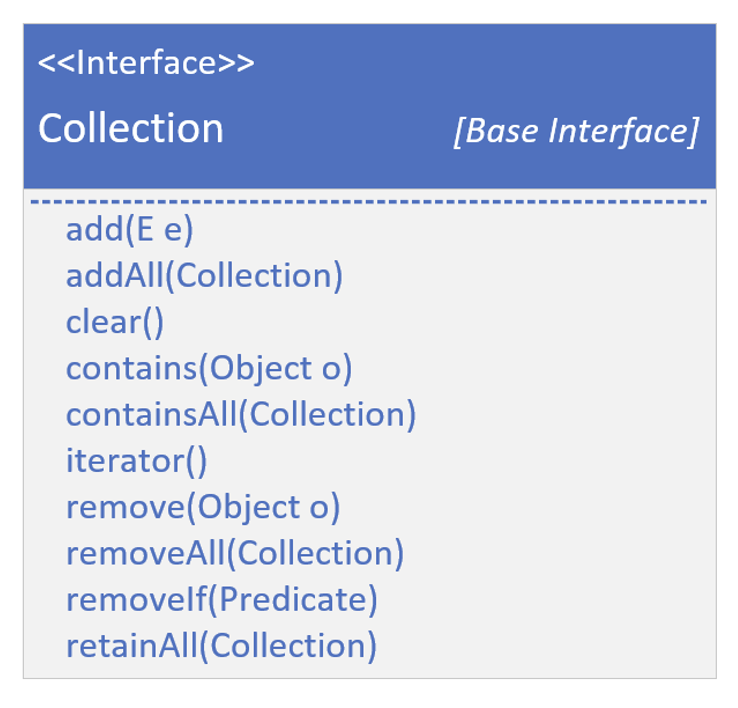
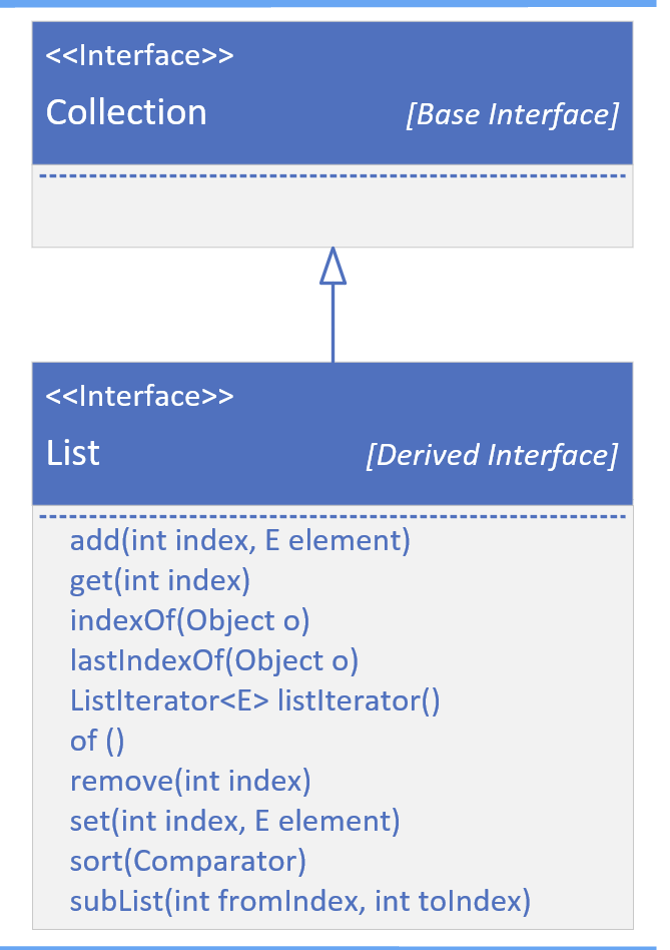
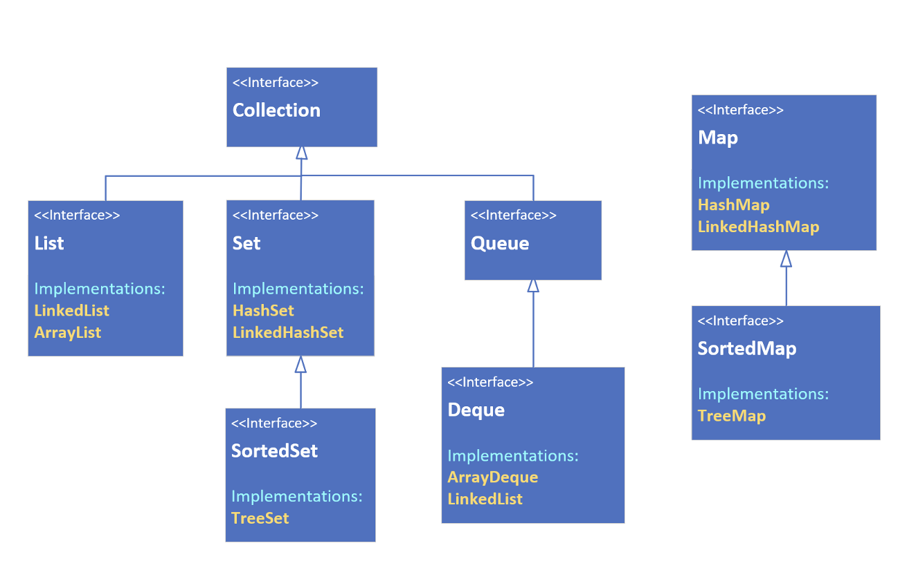
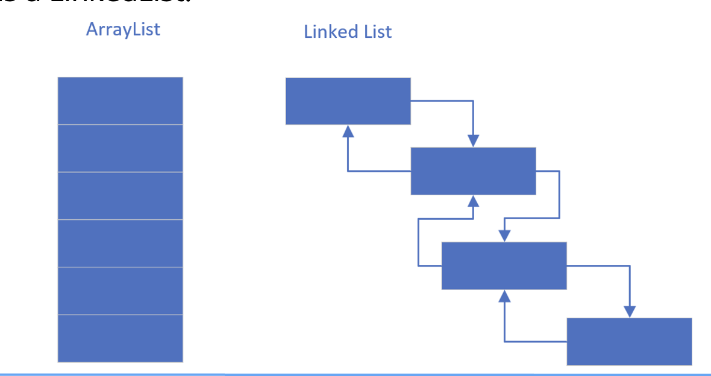
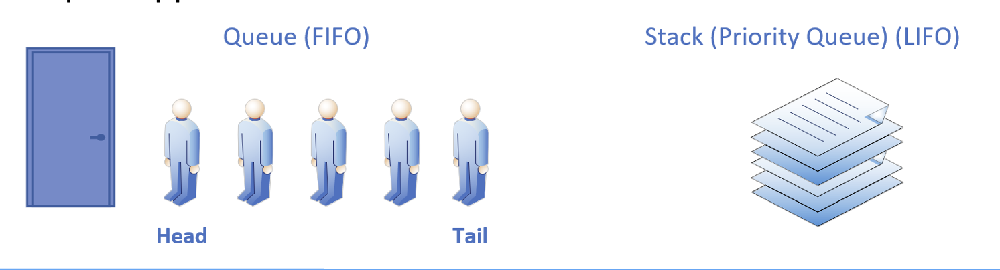
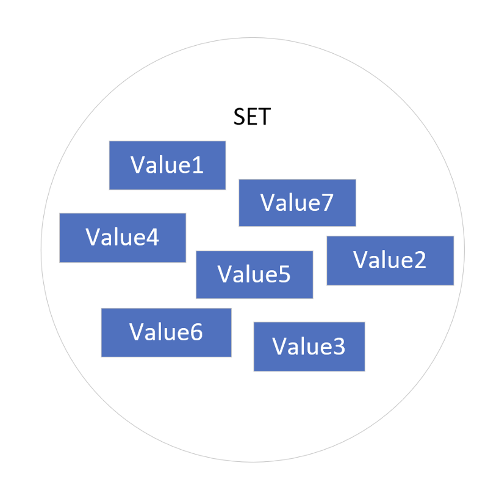
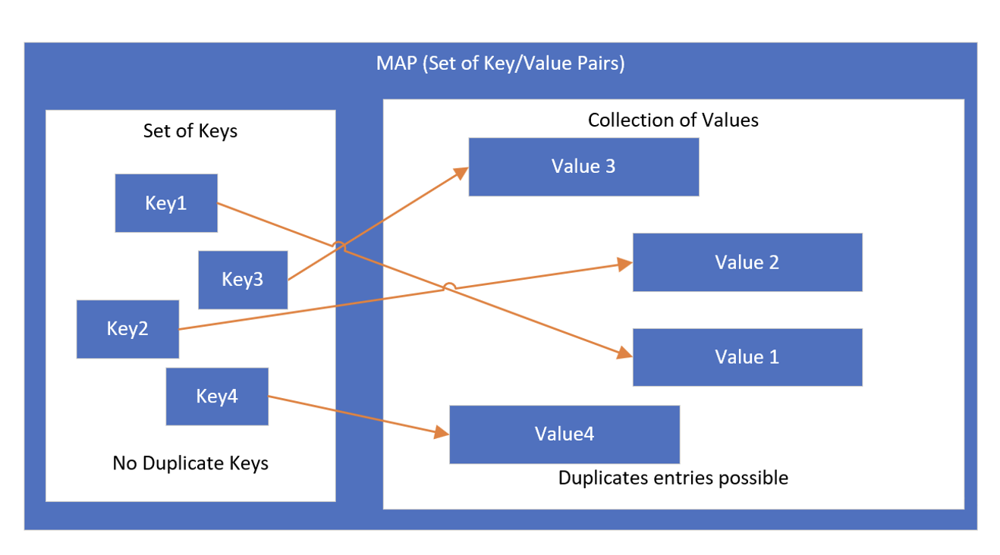

## A Collection Framework
Oracle's Java docs describes its collections framework as:

"A unified architecture for representing and manipulating collections, enabling collections to be manipulated independently of implemenation details."

https://docs.oracle.com/javase/8/docs/technotes/guides/collections/overview.html

This was written for JDK-8, but it still applies.

## What's in the framework, what's not?
Strictly speaking, `Arrays` and the Array utilities in the java.util.Arrays class are not considered part of this framework.

All collection objects implement the Collection interface, with the exceptioin of mapps, and we'll explain why in this section. The Collection interface is the foundation of the collection hierarchy in Java.

## The Collection Interface

As with most roots in software hierarchies, it provides an abstract representation of the behaviors needed to manage a group of object.

This interface is often used when we want to <b>pass collections</b> around and manipulate them with <b>maximum flexiblity and generality.<b>

Remember, an interface allows use to define objects by what they can do, rather than by thier specific structure or implementation.

If we examine the methods in the Collection interface, we'll see the fundamental operations that any collection, regardless of its specific type or structure, must support.

We've already explored these operations in our discussion on ArrayList and LinkedList.

When managing a group of objects, we'll typically be adding and removing elements, checking whether an element is present in the group, and iterating through the elements.

There are other methods as well, but these are the core actions we'll use to manage a collection.

In Java, the term <b>element</b> referes to a member of the collection being managed.

This slide shows the List interface extending Collection.

For simplicity, we're not showing the Collection methods that we showed on the previous slide.

Most of these are dealing with an index.

A list can be either indexed, as an ArrayList, or not, like a `LinkedList`, but a `LinkedList` is implemented to support all of these methods as well.

Derived interfaces may have specific ways to add, remove, get, and sort elements for their specific type of collection, in addition to those defined on the Collection Interface itself.

## Collections - The Big Picture

this slide show the interface hierarchy.

It's also showing the implementations or concrete classes, that implement these interfaces, in yellow font.

Notice that Map does not extend Collection, although it's still part of this framework.

Maps are uniquely different, which we'll explaining when we cover Maps in this section.

We can see that LinkedList implements both `List` and `Deque`, and we discussed this in detail when we covered LinkedList.

## The List
A List is an ordered collection (also known as a sequence).

These can be sequenced in memory like an `ArrayList`, or maintain links to the next and previous values, as a LinkedList.

## The Queue
A Queue is a collection designed for holding elements prior to processing, In other words, the processing order matters, so the first and last positions, or the head and tail, are prioritized.

Most often these may be implemented as `First In`, `First Out` (FIFO), but an be implemented like a Stack, as Last In First Out (LIFO) which we've discussed.

# The set
A set is a collection conceptually based off of a mathematical set.

Importantly, it contains <b>no duplicate elements</b>, and isn't naturally sequenced or ordered.

We can think of a set as a kind of penned in chaotic grouping of objects

Java has three implementations, which we'll be reviewing in this section of the course in detail, the `HashSet`, the `TreeSet` and the `LinkedHashSet`.

These are distinguished by the underlying way they store the elements in the set.

A SortedSet is a set that provides a total ordering of the elements.

## The Map

<b>A Map</b> is a collection that stores key and value pairs.

The keys are a set, and the values the key keeps a reference to a value.

Keys need to be unique, but values don't.

Elements in a tree are stored in a key value Node, also called on Entry.

## What's a polymorphic algorithm?
oracle's documentation describes a polymorphic algorithm as a piece of reusable functinality.

At one time, most of these methds were provided to us, as static method, on a class called <b>java.util.Collections.</b>

Since JDK-8, and the advent of multiple interface enhancements, some of these methods are now on the interfaces themselves, as default or static methods.

But not all are, so we'll be discussing this class, and what is has to offer, in comparison to what's available on each collection class.

It's also important to understand that legacy code will be using this class for some operations, that can be done from the class itself.
