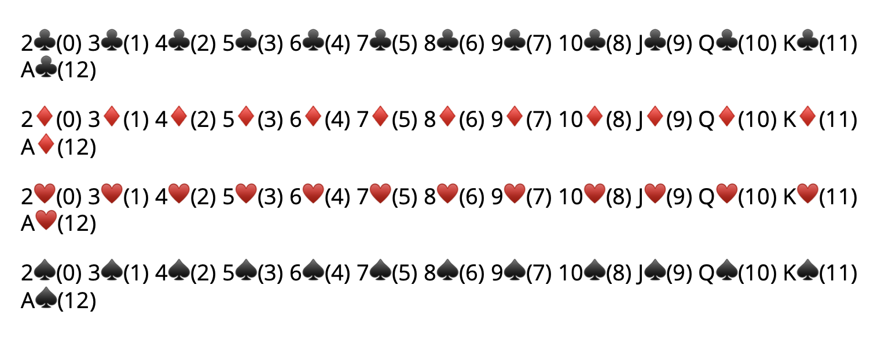
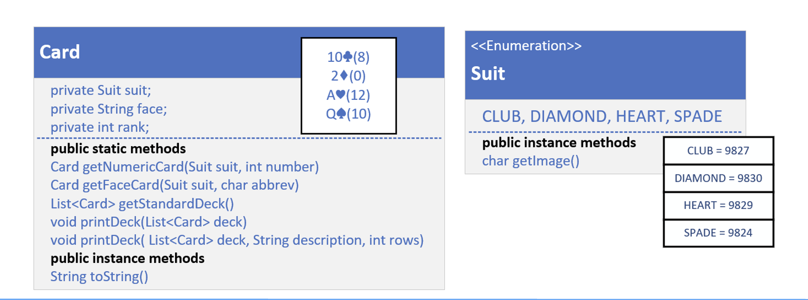

## The Setup
<b>Introduce this code as an optional challenge</b>, for those who really like the independent work.

In this video, we will set up a Card class, which will be used to create a deck of playing cards.

We'll be using these cards, and decks of cards, to demonstrate many of the methods on java.util.Collections.

The Card will have three fields:
- a Suit, meaning Club, Diamond, Heart, or Spade. This will be an enum.
- a face field, which will be a String, containing either the number of the card, or the face value of the card, Jack, Queen, King or Ace.
- a rank, an integer.

The Card should override the toString method and print the card with the face value (abbreviated, if a face card), the ASCII character of the suit, and the rank in parentheses.

We've included the ASCII characters that will print out each suit as a printable character.

| CLUB = 9827 |
| DIAMAOND = 9830 |
| HEART = 9829 |
| SPADE = 9824 |

The output shown here, shows all the cards in a standard deck of playing cards, sorted by suit and rank.

The Card should have the following public static methods to assist anyone using this class:
- getNumericCard which should return an instance of a Card, based on the suit and number passed to it.
- getFaceCard which should return an instance of a Card, based on the suit and abbreviation (J, Q, K, A) passed to it.
- getStandardDeck which should return a list of Cards you'd find in a standard deck. See the previous slide for a full set of Cards.

printDeck, which should take a description, a list of Card, and a row count.  This method will print the Cards out in the number of rows passed.

Finally, the Card should have an overloaded printDeck method, that will print "Current Deck" as the description, and use 4, as the number of rows to be printed.

We'll introduce it with a brief overview in the next video, and it will be in the resources section of that video, as well as this one.

## The class diagram for my solution

This slide shows my own plan, the class diagram I'll be coding towards.
We're going to create a Card class.

In my case We're just going to make it a record.

Using a record gives me built in immutability, if all my attributes are simple data types, like primitives and Strings.

Maybe you decided to create a Deck class, to contain your Cards, and that's a good idea too.

For the examples ahead, I'm just going to use List as my Deck container.

