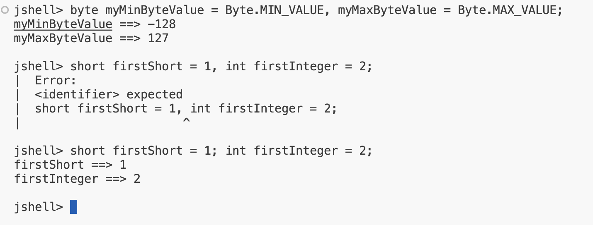
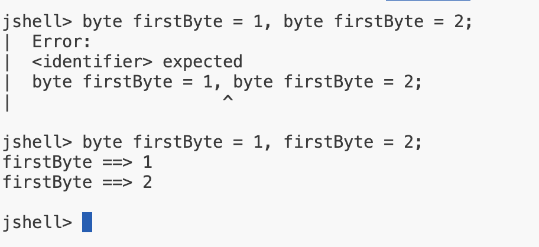
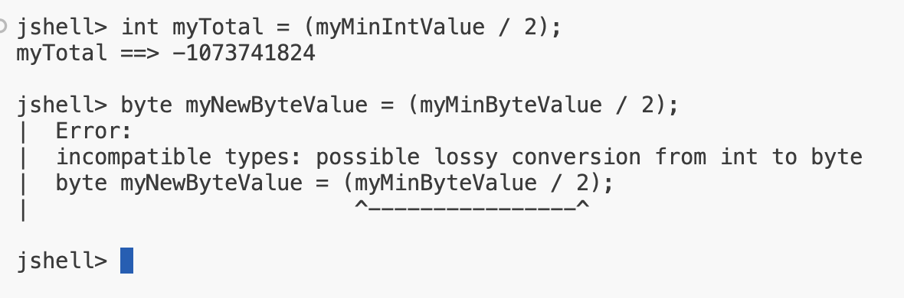
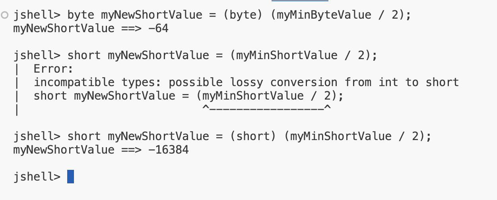

## Introduction
We'll be using these additional types in some basic arithmetic.

## Rules for declaring multiple variables in one statement
- We cannot declare variables with difference data types in a single statement.
- If we declare multiple variables of the same data type in a single statement, we must specify the data type only once before any variable names.

<b>First Rule</b>

<b>Second Rule</b>

## Assigning expressions to variables with data types that don't match

- The Java compiler does not attempt to evaluate the value, in a variable, when it's used in a calculation, so it doesn't know if the value fits, and throws an error.

<code>byte myNewByteValue = (myMinByteValue / 2);</code>
- If your calculation uses literal values, Java can figure out the end result at compile time, and whether it fits into the variable, and won't throw an error if it does.

<code>byte myNewByteValue = (-128 / 2);</code>
- In both examples, an int result is being returned from the calculation, but in the second example, Java knows the returned value can fit into a byte.

## What does it mean when Java defaults the data type to an int?

- What effect does int, being the default value, have on our code?
- Looking at the scenarios we just looked at in summary, we know the following:
This statement works because the result is an int, and assigning it to int variable is fine.

<code>int myTotal = (myMinIntValue / 2);</code>

- This statement doesn't work, becuase the expression <b>(myMinShortValue / 2)</b> is an int, and an int can't be assigned to a short, because the compiler won't guess the result.

<code>short myNewShortValue = (myMinShortValue /2)</code>
- This statement works, because the result of <b>(-128/2)</b> is an int, but when calculations use only literal values, the compiler can determine the result immediately, and knows the value fits into a short.

<code>short myNewShortValue = (-128 / 2);</code>

<b>Casting</b>
`And finally, this code works because we tell the compiler we know what we're doing by using this cast, and the compiler doesn't give an error.`

<code>short myNewShortValue = (short) (myMinShortValue / 2);</code>

