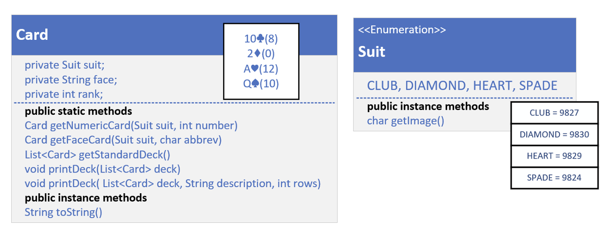

## What's a Collections Class?
It's important to understand that this Collections class is not the Collections Framework.

It's important to understand that this Collections class is not the Collections Framwork.

The framework contains many interfaces and implemented classes, as well helper classes, for which this Collections class is just one example.

At one time, Java had interfaces, but no support for static or default methods on them, so useful methods where packaged in these helper classes.

Some of these methos have since been implemented on the interfaces themselves, but there's still some functionality on the Collections class us might find useful.

We'll examine some of these in code, and compare them to the methods ont the interfaces now available.

## The Setup - a Quick Review

This code has Card, a record with a nested enum called Suit declared in it.

Suit is either a Club, Diamond, Heart or Spade, and this enum has a helper function, getImage, that returns a printable character value for that suit.

We overrode the toString method on Card, to print that character along with what I call the face, or face value of the card, so 2 through 10, or Jack, Queen, King, or Ace.

Each card will also have a rank, starting with 0 for the lowest card. 
In a standard deck, the lowest card, a two, is 0, because an Ace is usually the highest value card, though an Ace can represent a one sometimes.

The Card has static helper functions I'll be using in the code in this video, one to get an instance of a numeric Card, and one to get an instance of a face card.

In addition, I can get a list of Cards, that represents a standard deck of Cards.

There's also functions to print the deck of Cards.

