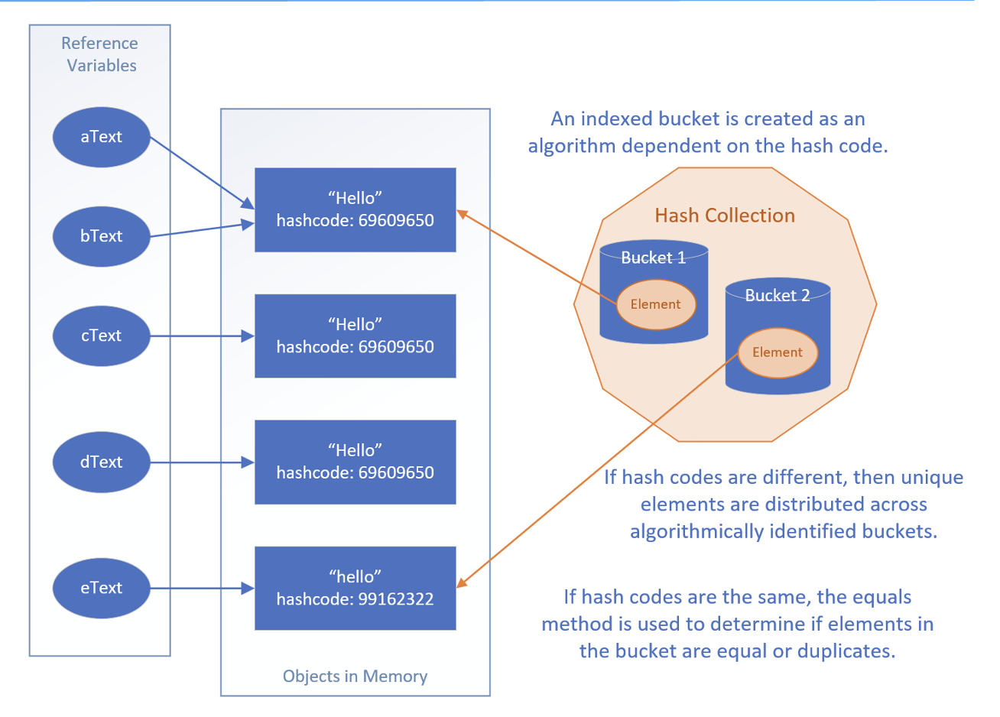

## Understanding the importance of the hash code
`HashSet` and `HashMap` are based on the hash codes of objects.
 
This can be a confusing topic for new programmers. we want to spend some extra time explaining it.

Since sets are designed to ensure eniqueness by not allowing duplicates, adding an element requires first checking if it already exists in the set.

For large sets, this check can become costly, potentially taking O(n) time, which is linear in relations to the size of the set, something we might recall from my discussion on Big O notation, earlier in the course.

One way to reduce this cost is through a technique called hashing.

By using hashing, we can distribute elements into different buckets. If we divide the elements into two buckets, and each elements can reliably determine its buckets, the lookup time can be roughly halved.

Similarly, if we use four buckets, the elements are distributed even further, which could reduce the number of comparisons needed in each bucket, improving lookup efficiency.

A hashed collection will optimally create a limited set of buckets, to provide an even distribution of the objects across the buckets in a full set.

A hash code can be any valid integer, so it could be one of 4.2 billion valid numbers.

If we collection only contains 100,1000 elements, we don't want to back it with a storage mechanism of 4 billion possible palceholders.

Additionally, iterating through 100,000 elements sequentially to find a match or duplicate would be inefficient.

Instead, a hasing mechanism takes an integer hash code and a capacity declaration that specifies the number of buckets over which to distribute the objects

It then maps the wide range of possible hash codes into a more manageable range of bucket identifiers.

Hashed implemenations often combine the hash code with other techniques to create an efficient bucketing system that aims to evenly distribute objects, thereby optimizing performance.

## Hashing starts with understanding equality
To understand hashing in Java, it helps to first understand the equality of objects.

We've touched on this in previous videos, but now we want to be sure thoroughly understand this subject, because it matters when dealing with any hashed collections.

There are two methods on java.util.Object, that all objects inherit.

These are equals, and hashCode, and we am showing the method signatures from Object here.
| Testing for equality | The hascode method |
| - | - |
| public boolean equals(Object obj) | public int hashCode() |

## The equals method on Object
The implementation of equals on Object is shown here.

It simply returns this == obj.

```java
public boolean equals(Object obj){
    return this == obj;
}
```

## Do we remember what == means for objects?
Do we remember what == means for objects?

It means two variables have the <b>same reference to a single object in memory</b>.

Because both references are pointing to the same object, then this is obviously a good equality test.

## Equality of Objects
Objects can be considered equal in other instances as well, if their attribute values are equal.

## The visual representaiton of the code

The code set up five String reference variables, but two of these referenced the same String object in memory, as shown here with `aText` and `bText` pointing to the same String instance.

When we passed the list of five strings to the HashSet, it added only unique instances to its collection.

It locates elements to match, by first deriving which bucket to look through, based on the hash code.

It then compares those elements to the next elements to be added, with other elements in that bucket, using the equals methods.

## Creating the hashCode method
We don't have to use the generated algorithm as we did here.

We could create our own, but our code should stick to the followng rules.
1. It should be very fast to compute.
2. It should produce a consistent result each time it's called, For example, we wouldn't want to use a random number generator, or a date time-based algorithm that would return a differnt value each time value each time the method is called.s
3. Objects that are considered equal should produce the same hashCode.
4. Values used int he calculation should not be mutable.

When implementing the hashCode method, it's common to use a small prime number as a multiplier, Prime numbers are preferred because they help spread out hash codes more evenly, reducing the chance that differnt objects will end up with the same hash code, which is important in data structures like HashMap or HashSet.

Using a prime number as a multiplier is especially useful if our data might naturally cluster or follow patterns, which could otherwise lead to uneven distribution of has codes.

FOr example, tools often use 31 as a multiplier, but other primes like 29, 37, or 43 work well too. Even some non-prime numbers, like 33, can give good results, though primes are generally better.

It's best to avoid small primies like 2, 3, 5, or 7 because many numbers are divisible by them, which could lead to less effective distribution and slower performance in hash-based collections.

We encourage to explore this topic further. For now, remember that when using our own classes in hahsed collections, it's important to override both the equals and hashCode methods.

## Java's Hashed Collection Types
Java supports four hashed collection implementations, which we'll be looking at coming up.

These are the HashSet, LinkedHashSet, the HashMap, and LinkedHashMap.

In addition, there's one legacy implementation, the HashTable, which we won't be covering since there are more efficient implementations which replace this legacy class.