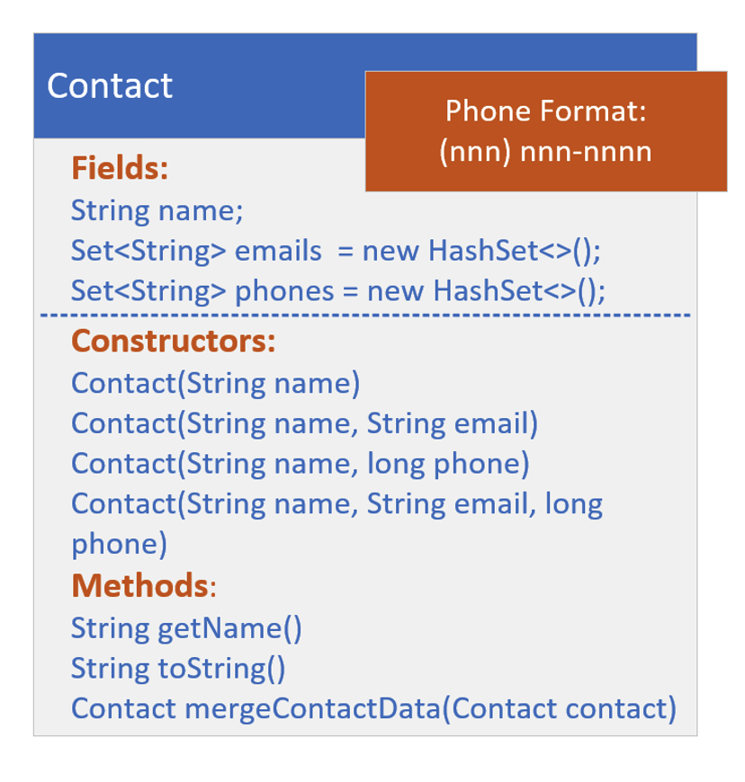

## The setup
In this example, <b>we'll be using `HashSets` as fields</b>, and I'll use the <b>Scanner</b> class, which I've used many times before.

<b>I'll be using Scanner with just a String passed to the constructor. </b>

It works similarly.  If you want to see this in action, be sure to follow along.

Eventually, I'll cover reading input from files, although the code in this video won't be doing that.

Using scanner this way gives you a taste for a way to do this.

Again, the purpose of having a separate setup video here, is to keep the new topic material more on point later.

## The Setup Challenge - The Contact Class

In this challenge, you need to create a Contact class, that has the fields, name, a String, emails, a HashSet of String, and phones, another HashSet of String.

This class should have four constructors.  

The first just takes a name.

The second should have name, and a single email of type String.

The third constructor should also have two arguments, name, and the second parameter being a long, which represents a 10-digit phone number.

Lastly, the fourth constructor that should do most of the work, the last in your chain, in other words, should take name, a single email, and a single phone. 

This last constructor should do the following:
- Add the email argument to the emails set, if email is not null.
- Transform the phone argument, a long, (if it's not zero), to a string in the format (123) 456-7890, for example.
- Add the transformed phone to the phones set.
Finally, include a method called mergeContactData, that takes a contact, and returns a <b>new Contact instance</b>, which merges the current instance with the Contact passed.

## The Setup Challenge - The Data (ContactData class)
The ContactData class is going to emulate getting data from an external source, but instead of an external source, I just want you to set this data up with two different text blocks, in the format shown on this slide.

This data purposely has duplicates.

| Phone Data | Email Data |
| - | - |
| Charlie Brown, 333444555 | Mickey Mouse, mckmouse@gmail.com |
| Maid Marion, 1234567890 | Mickey Mouse, micky1@gaws.com |
| Mickey Mouse, 99998887777 | Mickey Mouse, minnie@verizon.net |
| Mickey Mouse, 1247489758 | Robin Hood, rhood@gmail.com |
| Minnie Mouse, 4567805666 | Linus Van Pelt, lvpelt2015@gmail.com |
| Robin Hood, 567893000 | Daffy Duck, daffy@google.com |
| Robin Hood, 7899028222 | |
| Lucy Van Pelt, 5642086852 | |
| Mickey Mouse, 999887777 | |

<b>Create a Method named getData</b>, that <b>takes a String type</b> (either "phone" or "email") and <b>returns a List of Contact.</b>

Now, I'm going to use Scanner to parse the data in these text blocks. 

You're welcome to try another approach.

<b>Don't worry, you won't be missing any content I haven't already covered or won't cover shortly.</b>
