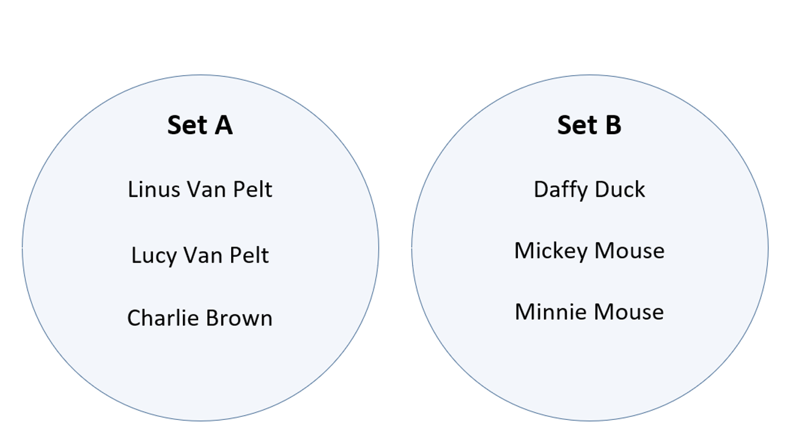
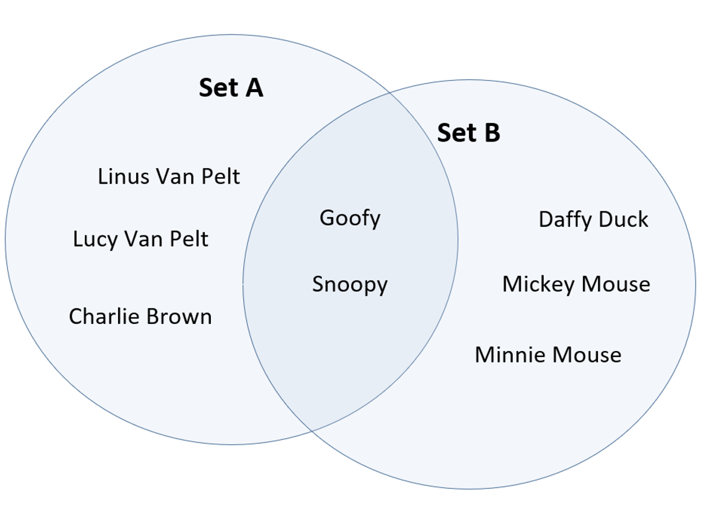
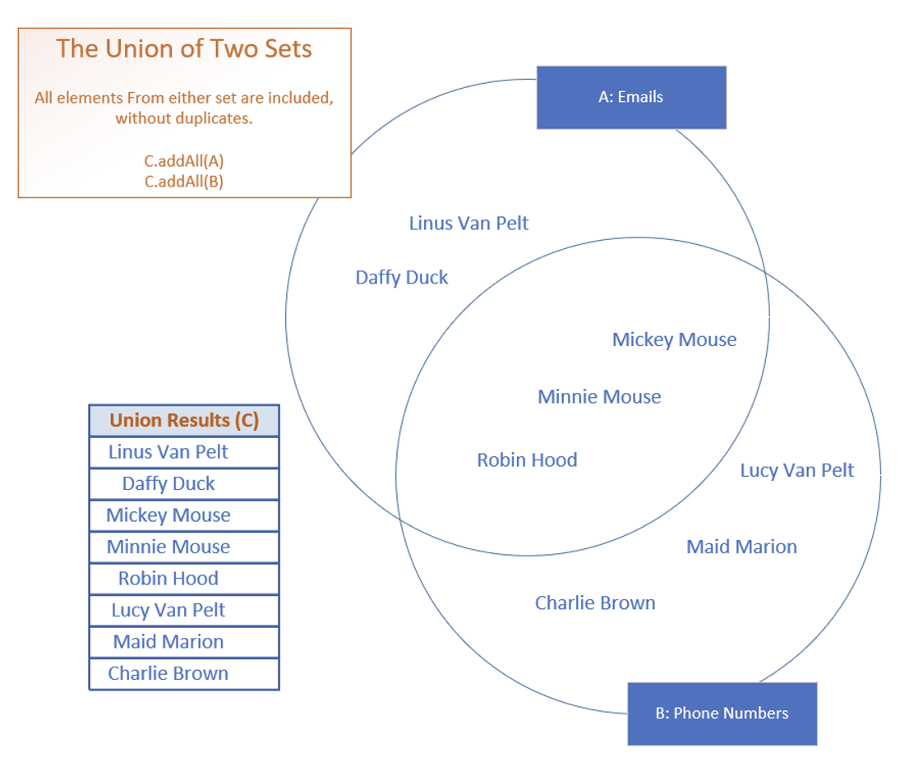
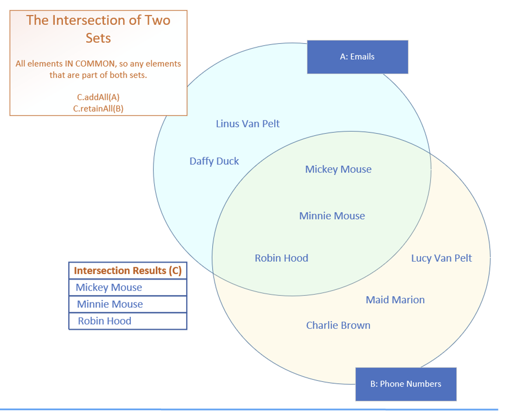
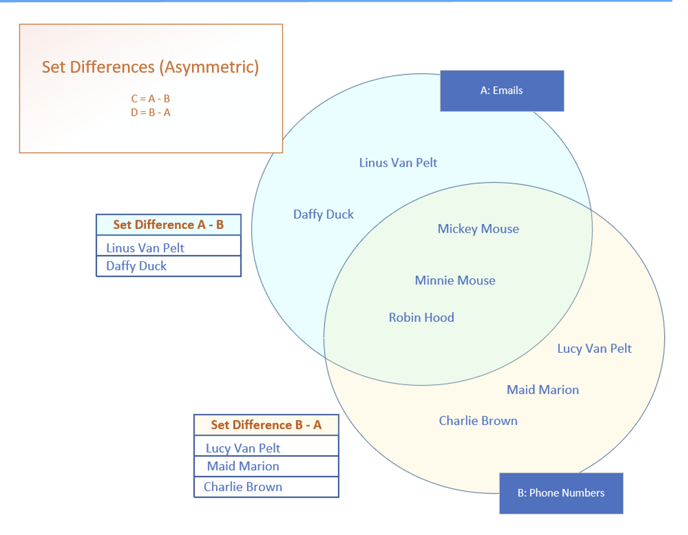
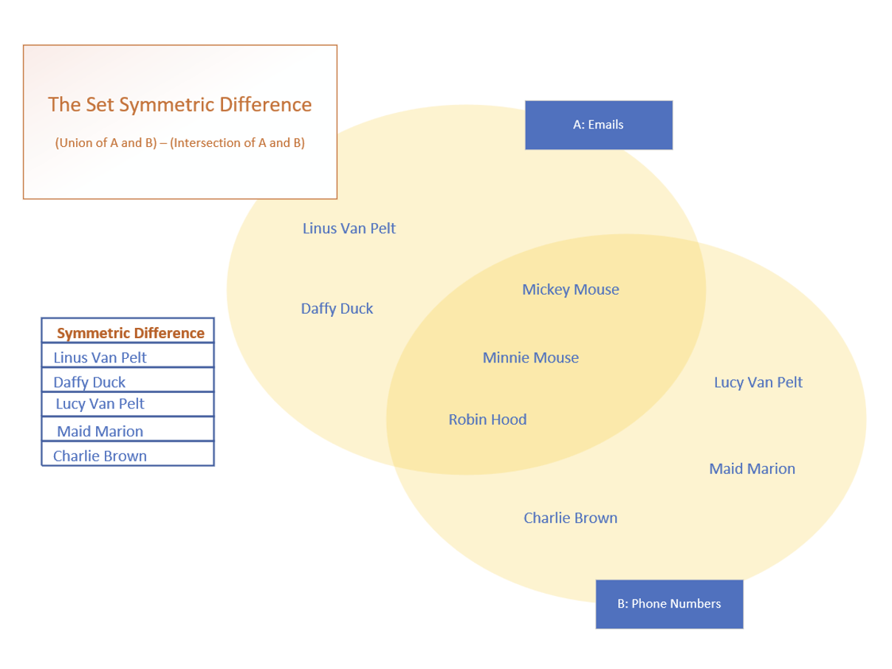

## Set Operations
We will see the explaination Set Math or Set Operations, first what they are, and second, why we'd want to use them.

When we're trying to understand data in multiple sets, we might want to get the data that's in all the sets, that's in every set, or the data where there's no overlap.

The collection interface's bulk operations (addAll, retainAll, removeAll, and containAll) can be used to perform these set operations.

## Representating Sets in a Venn Diagram
Sets are often representated as circles or ovals, with elements inside, on what is called a Venn Diagram.

Here, two Sets that have no elements in common.

This Venn Diagram shows some of the cartoon characters of the Peanuts and Mickey Mouse cartoons.

Because the characters are distinct for each Set, the circles representating the Sets don't overlap, or interset.

This diagram shows two Sets of characters that do overlap.

Let's say that Goofy and Snoopy have guest appearances in the other's holiday special show.

The intersection of these Sets is represented by the area where the two circles (sets) overlap and contains the elements that are shared by both Sets.

Goofy and Snoopy are both in Set A and Set B, in other words.

Venn Diagrams are an easy way to quickly see how elements in multiple Sets relate to each other.

## Set Operations - Union A ∪ B
The union of two or more Sets will return elements that are in any or all of the Sets, removing any duplicates.

This slide show here is showing our two Sets, names on an email list, and names on a phone numbers list.

The overlap are names that are on both list.

In the examples shown on this slide, all names on the email list and phone list will be included in union of the two Sets, but Minnie, Mickie and Robin Hood, which are the only elements included in both Sets, are incldued in the resulting Set only once.

Java doesn't have a union method on Collections, but the addAll bulk function, when used on a Set, can be used to create union of multiple sets.

## Set Operations - Interact - A ∩ B
The Interaction of two or more Sets, will return only the elements the Sets have in common.

These are shown in the overlapping are of the Sets on this slide, the intersect, shown in green, and includes Mickey and Minnie Mouse, and Robin Hood. 

## Set Operations - Symmetric Operations
The ability to evaluate Sets, A intersect B and get the same result as B intersect A, means that the intersect operation is a Symmetric Set operation.

Union is also a symmetric operation.

It doesn't matter if we do A Union B, or B union A, the final set of elements will both be the same set of names.

## Set Operations - Asymmetric Differences
A difference subtracts elements in common from on Set and another, leaving only the distinct elements from the first Set as the result.

This is an asymmetric operation because if we take Set A and substract Set B from it. we'll end up with a different set of elements than if we take Set B and substract Set A.

The Sets from these two operations won't result in the same elements.

## Set Operations - Symmetric Differnces
We can think of the set symmetric difference, as the elements from all Sets that don't intersect.

On this slide, these are the elements that are represented in the <b>paler</b > yelow areas.
