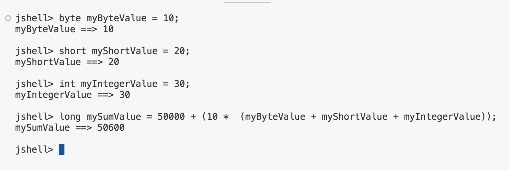
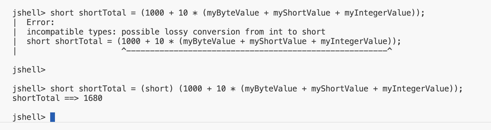

## Primitve Type Challenge
Your challenge is to create four new variables:
- A byte variable, set it to any valid <b>byte</b> number, it doesn't matter.
- A short variable, set it to any valid <b>short</b> number.
- An int variable, set it to any child <b>integer</b> number.
- Lastly, create a variable of type long. Make it equal to 50,000 plus 10 times the sum of the first 3 variables (your byte, your short and your int values). In other words, use the variable names in your expression to calculate the sum.

## Using Parenttheses

Parentheses are another way to make your code more readable.

<code> mySumValue = 5000L + (10 * (myByteValue + myShortValue + myIntegerValue));</code>
They also make it clea withc calculation should be done first.

<b>Full casting</b>

## Recap
For byte, shorts, integers and longs, which are the first four primitve types in Java's list of available types.