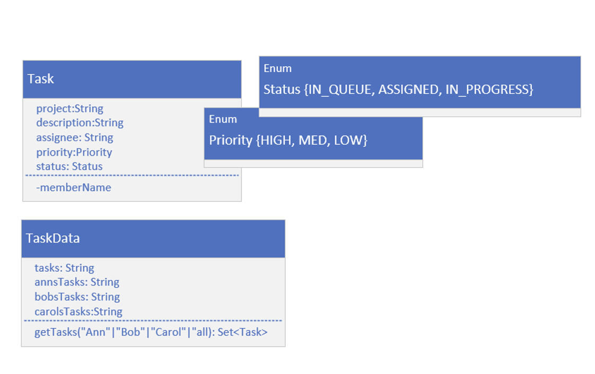

## Set Operations Challenge - Task and Task Data

This class diagram shows you the two classes.   

Task has five fields, two with enum types as shown.

Task is unique by the project and description fields combined.

Task implements comparable and is sorted by project then description.

Some test data was set up on the TaskData class, and you can get this data by calling TaskData.getTasks, passing it the names, Ann, Bob, or Carol, or any other string, like "all", to get all tasks.

## Set Operations Challenge
Let's say that you're a new manager of a team that consists of three team members working under you, Ann, Bob, and Carol.

Each of these developers is working on a set of tasks.

You've asked your developers to submit what they're working on to you.

You also have a master set of tasks, which your boss sent to you.

## Set Operations Challenge - Answer these questions
You'll be using that data to answer the following questions.
- What is the full task list? This is the list of all tasks described by your manager, and any additional tasks the employees have, that may not be on that list.
- Which tasks are assigned to at least one of your 3 team members?
- Which tasks still need to be assigned?
- Which tasks are assigned to multiple employees?
  To do some of this work, create three methods on your Main class.

Be sure the Sets you pass to these methods don't mutate in these methods. In other words, return a new Set.
- Create a getUnion method, that takes a List of Sets and will return the union of all the Sets.
- Create a getIntersect method, that takes two Sets and returns the intersection of the Sets.
- Create a getDifference method, that takes two Sets and removes the second argument's Set from the first.
