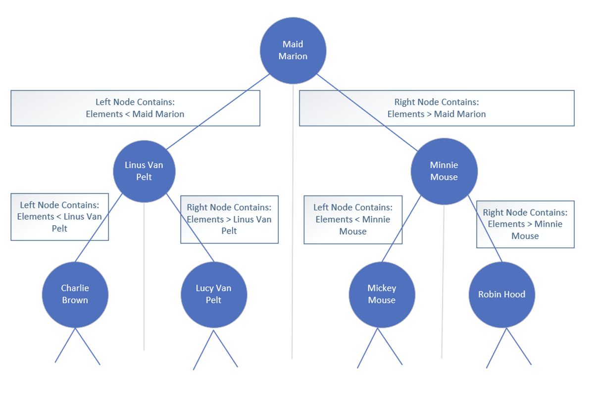
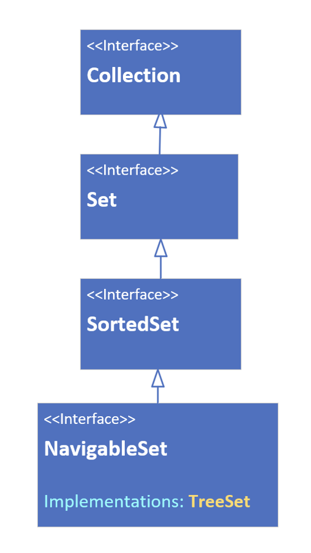

## Ordered Sets
If we need an ordered set, we'll want to consider either the <b>LinkedHashSet</b> or the <b>TreeSet</b>

A LinkedHashSet maintains the insertion order of the elements.

The TreeSet is a sorted collectioin, sorted by the natural order of the elements, or by specifying the required sort during the creation of the set.

## The LinkedHashSet
The LinkedHashSet <b>extends the HashSet</b> class.

It maintains relationship between elements with the use of doubly linked list between entries.

The <b>iteration order</b> is therefore the same as the <b>insertion order</b> of the elements, meaning the order is <b>predicable</b>.

All the methods for the LinkedHashSet are the same as those for the HashSet.

Like HashSet, it provides constant-time performance, O(1) for the add, contains and remove operations.

## TreeSet
A TreeSet's class uses a data structure that's a derivative of what's called a binnary search tree, or Btree for short, which is based on the concept and efficient of the binnary search.

We've discussed the binnarySearch method on List, as well as the java.util.Collections clsas, and shown that this type of search is very fast, if the elements are shorted.

This search iteratively tests the mid-range of a group of elements to be searched, to quickly find its elements, in a collection.

As elements are added to a TreeSet, they're organized in the form of a tree, where the top of the tree represents the mid-point of the elements

This slide shows a conceptual example, using some of the String contacts from my last samples of code.

Further binary division become nodes under that.

The <b>left</b> node and its children are elements that are <b>less than</b> the parent ndoe.

The <b>right</b> node and its children are elements that are <b>greather than</b> the parent ndoe.

Instead of looking through all the elements in the Collection on locate a match, this allows the tree to be quickly traversed, each node being a simple decision point.

The main point is the tree remains balanced as elements are added.

## TreeSet O Notation
Remember that O(1) is constant time, meaning the time or cost of an operation doesn't change, regardless of how many elements are processed.

O(n) is linear time, meaning it grows in line with the way the collection grows.

Another notation is O(log(n)), which means the cost falls somewhere in between constant and linear time.

The TreeSet promises O(log(n)) for the add, remove, and contains operations, compared to the HashSet which has constant time O(1) for those same operations.

## The TreeSet interface hierarchy

A TreeSet can be declared or passed to arguments typed with any of the interfaces shown on this slide.

This class is sorted, and implementations the SortedSet interface, which has methods such as first, last, headSet, and tailSet, as well as comparator.

This set also implements the NavigableSet Interface. As such, it has methods such as ceiling, floor, higher, lower, descendingSet and others.

## The TreeSet relies on Comparable or Comparator methods
Elements which implement Comparable (said to have a natural order sort, like Strings and numbers) can be elements of a TreeSet.

If our elements don't implement Comparable, we must pass a Comparator to the constructor.

