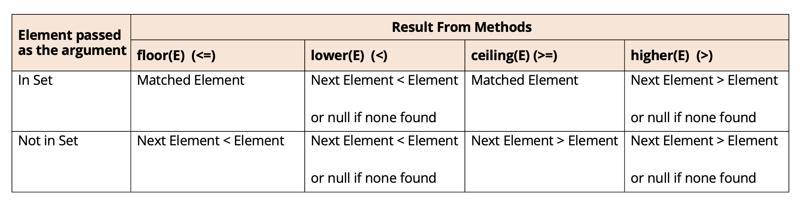

## NavigableSet methods to get closet matches
All the methods shown on this slide take an element as an argument, and return an element in the Set, the closet match to the element passed

## Getting subsets from a TreeSet.
All three methods, headSet, tailSet and subSet of elements, backed by the original Set.

| sub set method                                                                                                      | inclusive                                                                                  | description                                                                                                |
|---------------------------------------------------------------------------------------------------------------------|--------------------------------------------------------------------------------------------|------------------------------------------------------------------------------------------------------------|
| headSet(E toElement headSet(E toElement, boolean inclusive)                                                      | to Element is exclusive if not specified                                                   | return all elements less than the passed toElement (unless inclusive is specifically included)             |
| tailSet(E fromElement) tailSet(E toElement, boolean inclusive)                                                   | fromElement is inclusive if not specified                                                  | returns all elements greather than or equal to the formElement (unless inclusive is specifically included) |
| subSet(E fromElement, E toElement subSet(E fromElement, boolean fromInclusive, E toElement, boolean inInclusive) | from Elements is inclusive if not specified  toElement is exclusive if not specified | return elements greather than or equal to fromElement and less than toElement.                             |

## WHen would we use a TreeSet?
The TreeSet provides several advantages due to its built-in functionality, especailly compared to other Set implementations. However, it comes with a higher performace cost.

Consider using a TreeSet when:
- We have a moderate number of elements.
- We need a collection that is automatically sorted and remains sorted as elements are added or removed.
- We want to ensure that no duplicate elements are stored.
In such cases, TreeSet is a strong alternative to ArrayList, especially when we need both sorting and uniqueness. 