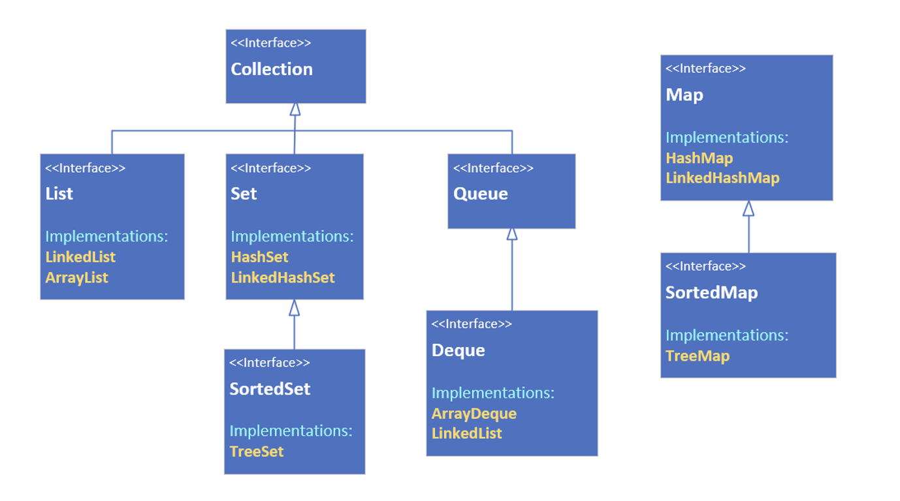

## The Map Interface, why is it different?

From this diagram on the slide, we can obviously see the Map is out here on its own.

A map in the collection's framework is another data structure.

Although it's still a groupoing of elementing, it's different because elements are store with keyed references.

This means a Map requires two type arguments, as we can see on this slide, where we're showing the root interface, Collection compared to the Map interface.

| Collection Interface | Map Interface        |
| - |----------------------|
| interface Collection<E> extends Interable<E> | interface Map<K, V>  |

The Map has K for it's key type, and V for the value type.

As with any generic classes, the only restriction on these types is that they must be reference types, and not primitives.

## Map characteristics
A Java Map can't contain duplicate keys.

Each key can only map to a single value.

## Map Implementations (the classes that implement Map)
We'll be looking at 3 of the Java classes that implement the map interface, the <b>HashMap</b>, the <b>LinkedHashMap</b>, and the <b>ThreeMap.</b>

The HashMap is unordered, the LinkedHashMap is ordered by insertion order, and the <b>TreeMap</b> is a sorted map.