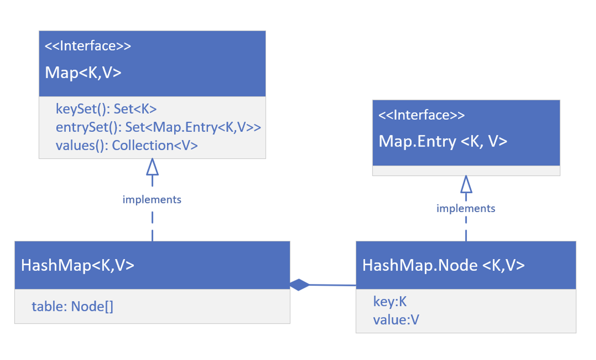
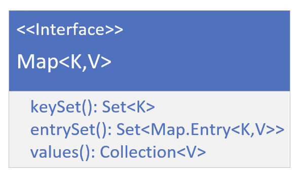

## What's a view?
THe view, or view collection as Java calls it, doesn't store elements, but depends on a backing collection that stores the data elements

We saw this with the headSet, tailSet and subSet methods on Sets.

We're also very familiar now, with a list backed by an array, a view we get back when we use the Array.asList method, to get an array in the form of a list.

We'll remember when we make changes to that list, the changes are reflected in the underlying array, and vice versa.

The functionality available to us on the list is limited to features supported by the backing storage, so for a list backed by an array, we can't add or remove elements as an example.

## The purpose of view collections
We might be familiar with database views, which hide the details of the underlying data structures, to make it easier for clients to use the data.

These view collections serve a similiar purpose.

They let use manipulate the collections, without really having to know the exact details about the storage of the data.

In other words, we don't keep learning new methods to manipulate data.

As long as we can get a collection view of the data, we can use many of the collection methods, to simplify our work.

## The HashMap's implementation

On this slide, we're showing a high-level overview of the structure of the HashMap class.

First, it's important to know that there's a static nested interface on the Map interface, and that its name is Entry.

Concrate classes implement both the Map interface, and the Map.Entry interface.

The HashMap implements Map, and has a static nested class, Node, that implementations the Map.Entry interface.

The HashMap maintains an array of these Nodes, in a field called table, whose size is managed by Java, and whose indices are determinded by hasing functions.

For tis reason, as HashMap is not ordered.

## The Map's view collections
We want to focus now on the three view collections we can get from the map. These are the keyGet, the entrySet, and values.

We know a map has keys, and these can't contain duplicates.

These keys can be retrieved as a Set view, by calling the keySet method on any map object.

Each key value pair is stored as an instance of an Entry, and the combination of the key and value will be unique, because the key is unique.

A Set view of these entries, or nodes in the case of the HashMap, can be retreived from the method entrySet.

Finally, values are stored, and refereneced by the key, and values an have dupliates, meaning multiple keys could reference a single value.

We can get a Collection view of these, from the values method, on a map instance.

## Functionality available to set returned from keySet()
The Set returned from the keySet method, is backed by the Map.

This means changes to the Map are reflected in the Set, and vice-versa.

The Set supports element removal, which removes the corresponding mapping from the Map.

We can use the methods remove, removedAll, retainAll, and clear.

It does not support the add or addAll operations.
