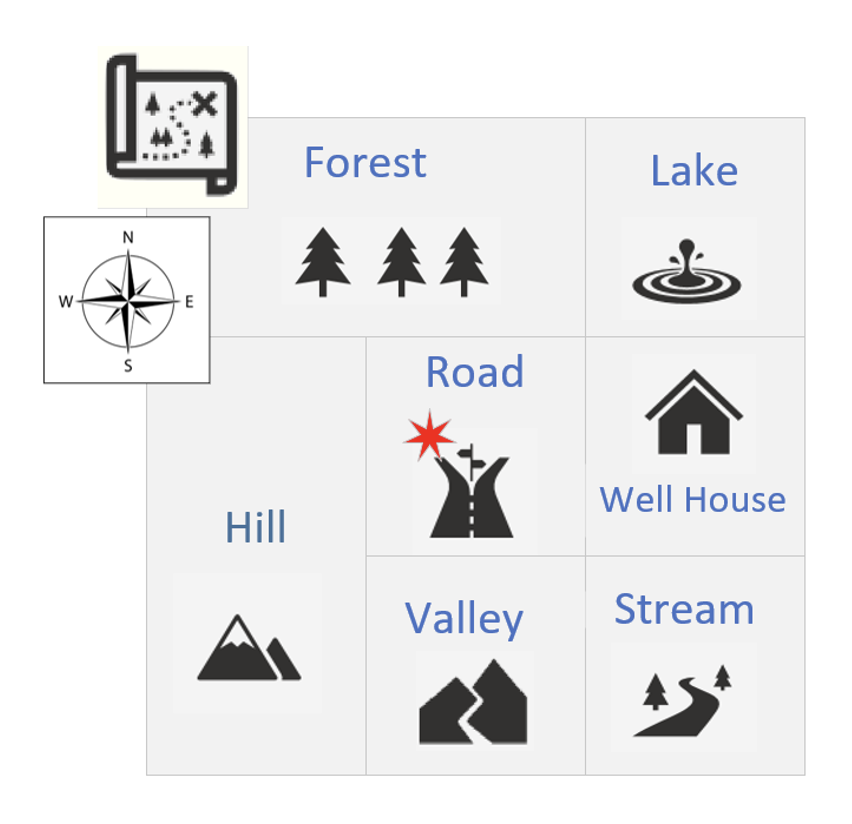
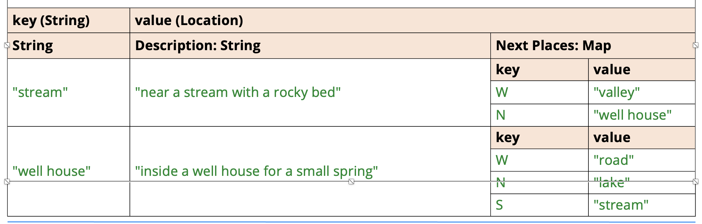

## The Adventure Game
In this challenge, you'll be creating a text-based game, using a HashMap.

This game will be loosely based on the original Colossal Cave Adventure, which was one of the first adventure games and came out way back in 1975.

## The Adventure Game's Conceptual Map


This slide shows a conceptual map of the game I want you to build.

The game starts with the user standing in a road, in the center of the map.

North would take the user to the Forest and South would take the user to the Valley. East would be the Well House, and West would be the Hill.

## The Adventure Game

You'll want to use two HashMaps in this challenge, one for the board locations, and one for the next places data.
This slide shows one way to structure your data.

Use a HashMap for the game board locations, keyed on a short descriptor, road or stream, for example, or some other key of your choice.

Your Location class should have a location description, and could also have a field, a HashMap, to store next places to go from there.

Use the console to describe to the player what their current location is, starting at the road, and show the player what options they have to go from here.

Prompt the player to enter the direction they want to go next.

Continue to play until the user quits, perhaps using Q for quit.

```java
*** You're standing inside a well house for a small spring ***
    From here, you can see:
    - A road to the West (W)
    - A road to the North (N)
    - A stream toroad to the South (S)
Select Your Compass Direction (Q to quit) >>
```

## The Adventure Game Bonus

A bonus part of the challenge is to allow customizations to the board locations, as well as the next place directions.

