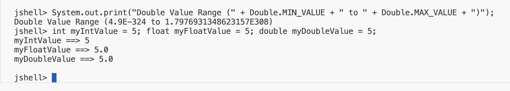
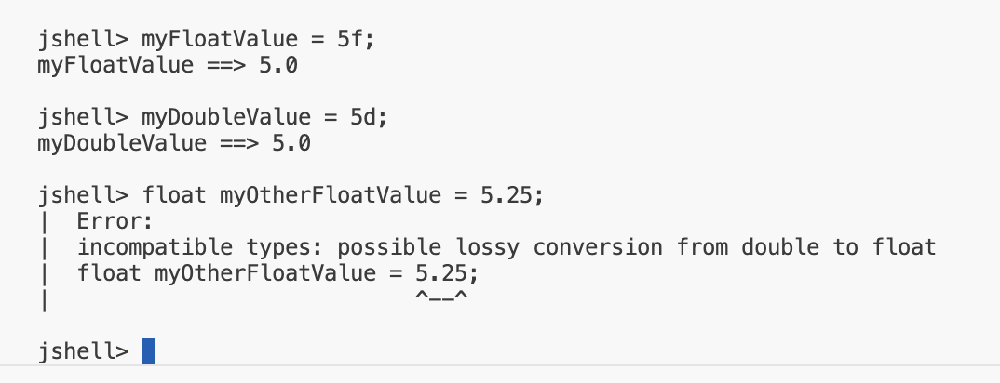

## Floating-point Numbers
Unlike whole numbers, floating-point numbers have fractional parts that we express with a decimal point.

We can see some examples of both whole numbers and floating point numbers, in comparison.

| Whole Number Examples | Floating Point Examples |
| -- | -- |
| 3 | 3.14159 |
| 100000 | 10.0 |
| -2147483649L | -0.666666666666666667 |

Floating-point numbers are also known as real numbers.

## Floating-point Number Data Types
`We use a floating-point number when we need more precision in calculations.`

There are two primitive types in Java for expressing floating-point numbers, the float and the double.

| Java's Data Types For Floating Point Numbers |
| -- |
|
float double
  The double is Java's defaults type for any decimal or real number|

The double is Java's default type for any decimal or real number.

## Single and Double Precision
<b>Precision</b> refers to the format and amount of space occupied by the revalent type.

Below shows the width of each of the floating point types and their ranges.

The ranges are shown in Java's scientific notation, which we show below in blue color.

| Data Type | Width (in bits) | Min Value | Max Value |
| -- | -- | -- | -- |
| float | 32 | 1.4<b>E-45</b>| 3.4028235<b>E38</b> |
| double | 64 | 4.9<b>E-324</b>| 1.7976931348623157<b>E38</b> |

We can see the <b>e-notation</b> followed by either a positive or negative number.

## Java's Scientific Notation
Scientific notation ca be translated into more familiar terms, by replacing the <b>'E'</b> in the number, with the phrase <b>'times 10 to the power of'</b>

1.4<b>E-45</b> is the same as <inline style="color: red">1.4 x 10<inline style="font-size: 8px">-45</inline></inline> and 3.4<b>E38</b> is the same as <inline style="color: red">3.4 x 10<inline style="font-size: 8px">38</inline></inline>

| Data Type | Min Value | Max Value |
| -- | -- | -- |
| float | 1.4<b>E-45</b> | 3.4028235<b>E38</b> |

So we can say, the minimum value of a float is <inline style="color: red">1.4 x 10<inline style="font-size: 8px">-45</inline></inline> and its maximum value is approximately <inline style="color: red">3.4 x 10<inline style="font-size: 8px">38</inline></inline>

## float and double and numeric literal suffixes

<b>Important:</b> The double data type is Java's default type for real numbers.
- For example, any number with a decimal is a double.
- So, 10.5 is a double by default in Java.
- The double data type can be specified as a numeric literal witha suffix of either lowercase <b>'d'</b>, or uppercase <b>'D'</b>, `but because doubles are the default in Java, the suffix is optional to use`.
- The float data type can be specified as a numeric literal with a suffix of lowercase <b>'f'</b>, or uppercase <b>'F'</b>. `This suffix is required if you are assigning a real number to a variable that was declared with a float type`.

## Challenge

Thinking back to our discussion on casting, how do you think you'd do the same for the float to remove this error? Talking about using casting here, specifically, because, as we have learned, we could just use the suffix f to tell Java this is a float. Here We want to use casting.

## Certification Exam Pointer

Not everyone realizes that java's default data type for a decmial literal is a double, which is larger and more precise than a float.

Oracle likes to put a similar line of code in its code segments on exam questions, omitting the <b>'F'</b> suffix. Without a computer to check. this statement can look fairly innocuous.

`float myOtherFloatValue = 5.25;`

- The number 5.25 is a double, so assigning it to a float will <inline style="color: red">raise an error</inline>
- This is a gift question to an exam taker, if you can easily spot this compiler error.