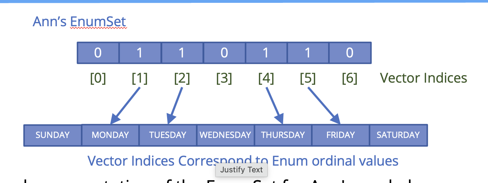

## EnumSet and EnumMap
Before we move on, we want to talk about two more classes in the collection's framework, specifically created to support enum types more efficiently.

We can use any `List, Set, or Map`, with an enum constant.

The `EnumSet` and `EnumMap` each have a special implementation that differs from the `HashSet` or `HashMap`.

These implementations make these two types extremely compact and efficient.

There's no special list implementation for enum types.

## The EnumSet
The `EnumSet` is a specialized Set implementation for use with enum values.

All of the elements in an EnumSet must come from a single enum type.

The EnumSet is abstract, meaning we can't instantiate it directly.

It comes with many factory methods to create instances.

In general, this Set has much better performance than using a HashSet with an enum type.

Bulk operations (such as `containsAll` and `retianAll`) should run very quickly, in constant time, O(1), if they're run on an `EnumSet`, and their argument is an `EnumSet`.

## The EnumMap
The `EnumMap` is a specialized Map implementation for use with enum type keys.

The keys must all come from the same enum type, and they're ordered naturally by the `ordinal` value of the enum constant.

This map has the same functionality as a `HashMap`, with O(1) for basic operations.

The enum key type is specified during construction of the EnumMap, either explicitly by passing the key type's class, or implicitly by passing another `EnumSet`.

In general, this map has better performance than using a HashMap, with an enum type.

## Two Types of EnumSet implementations
EnumSets are represented internally as bit vectors, which are just a series of ones and zeros.

A one indicates that the enum constant (with an ordinal value that is equal to the index of the bit) is in the Set.

A zero indicates the enum constant is not in the set.

Using a bit vector allows all Set operations to use bit match, wich makes it very fast.

A `RegularEnumSet` uses a single long as its bit vector, which means it can contain a maximum of 64 bits, representing 64 enum values.

A `JamboEnumSet` gets returned if we have more than 64 enums.

## Ann's Work Day EnumSet

MONDAY has an ordinal value of 1 in our WeekDays enum, and the value in the underlying bit vector, at position 1, is a 1.

This means MONDAY is part of Ann's EnumSet.